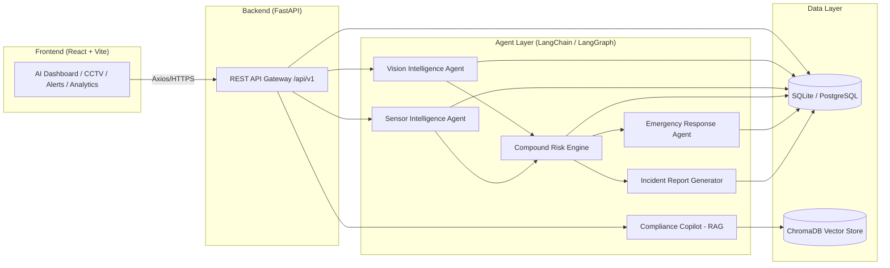

# SentinelAI

**AI-Powered Industrial Safety Intelligence Platform**

[](./LICENSE)
[](./docs/PROJECT_MEMORY.md)
[](./docs)

---

## Project Overview

SentinelAI is an enterprise-grade industrial safety monitoring platform that unifies **Computer Vision, AI Reasoning, Risk Analysis, Compliance Assistance, and Emergency Response** into a single operational dashboard.

It is designed for industrial sites — factories, warehouses, construction sites, and plants — where real-time hazard detection and rapid, explainable decision-making directly protect human lives.

SentinelAI was architected as a production-grade system, not a prototype. Every module, API, and data contract defined in this repository is intended to be implementation-ready for a professional engineering team.

---

## Vision

To give every industrial site an always-on AI safety officer: one that watches CCTV feeds and sensor networks, reasons about compound risk in real time, keeps operators compliant with safety regulations, and coordinates emergency response the moment a hazard is detected — all while remaining fully explainable to human supervisors.

---

## Features

SentinelAI is built around six core AI agents and four supporting operational modules.

**AI Agents**

- **Vision Intelligence Agent** — Real-time object and hazard detection from CCTV feeds using YOLOv8 and OpenCV (PPE violations, restricted-zone intrusion, fire/smoke, unsafe machine operation).
- **Sensor Intelligence Agent** — Ingests and interprets industrial sensor telemetry (gas levels, temperature, vibration, pressure) to flag anomalies.
- **Compound Risk Engine** — Fuses vision and sensor signals into a unified, explainable risk score per zone/site.
- **Compliance Copilot (RAG)** — Retrieval-augmented assistant over safety regulations and internal SOPs, built on ChromaDB and Sentence Transformers.
- **Emergency Response Agent** — Determines and recommends the correct emergency protocol when a critical risk threshold is crossed.
- **Incident Report Generator** — Automatically drafts structured, audit-ready incident reports from detection and sensor evidence.

**Operational Modules**

- **AI Dashboard** — Unified command center for live risk state across all monitored sites.
- **Analytics** — Historical trends, incident frequency, compliance posture, and agent performance.
- **Alerts** — Real-time, severity-ranked notifications routed to the correct stakeholders.
- **CCTV Monitoring** — Live and recorded video feed management with in-frame AI annotations.

---

## Architecture Overview

SentinelAI follows a modular, agent-based architecture. The frontend never talks to AI agents directly — all traffic is mediated by the FastAPI backend, which orchestrates agents and owns all persistence.



For full architectural rules and diagrams, see [`docs/ARCHITECTURE_RULES.md`](./docs/ARCHITECTURE_RULES.md).

---

## Technology Stack

| Layer | Technology |
|---|---|
| Frontend | React, Vite, TailwindCSS, React Router, Axios, Recharts |
| Backend | Python, FastAPI |
| AI | YOLOv8, OpenCV, LangChain / LangGraph, OpenAI API, Sentence Transformers |
| Vector Database | ChromaDB |
| Primary Database | SQLite (MVP) → PostgreSQL (Production) |
| Version Control | Git + GitHub |
| Deployment | Docker (optional), Render / Railway / Vercel |

---

## Folder Structure

```
SentinelAI/
├── docs/               # Architecture, standards, roadmap, and process documentation
├── frontend/           # React + Vite dashboard application
├── backend/            # FastAPI application (API layer, services, models)
├── agents/             # AI agent implementations (Vision, Sensor, Risk, Compliance, Emergency, Incident)
├── datasets/           # Training/reference datasets and sample media
├── database/           # Schema definitions, migrations, seed data
├── presentation/        # Pitch deck and demo-day presentation assets
├── demo/               # Demo scripts, sample data, walkthrough assets
├── claude-prompts/     # Governing prompts (including 00_MASTER_CONTEXT.md)
├── .github/            # Issue templates, PR templates, workflows
└── tasks/              # Task tracking artifacts
```

See [`docs/PROJECT_MEMORY.md`](./docs/PROJECT_MEMORY.md) for the authoritative, living version of this structure.

---

## Getting Started

> These steps describe the target developer workflow. Implementation scaffolding (package.json, requirements.txt, Docker config) is delivered in a subsequent engineering phase per [`docs/ROADMAP.md`](./docs/ROADMAP.md).

**Prerequisites**

- Node.js 18+
- Python 3.11+
- Git

**Frontend**

```bash
cd frontend
npm install
npm run dev
```

**Backend**

```bash
cd backend
python -m venv venv
source venv/bin/activate
pip install -r requirements.txt
uvicorn main:app --reload
```

**Environment Variables**

Backend and agent services require an `OPENAI_API_KEY` and database connection string. See `backend/.env.example` (to be generated in a later phase) for the full list.

---

## Repository Structure

Full folder-by-folder responsibilities, naming conventions, and boundaries are defined in:

- [`docs/PROJECT_MEMORY.md`](./docs/PROJECT_MEMORY.md) — single source of truth
- [`docs/ARCHITECTURE_RULES.md`](./docs/ARCHITECTURE_RULES.md) — system boundaries and module rules
- [`docs/CODING_STANDARDS.md`](./docs/CODING_STANDARDS.md) — naming and formatting conventions

---

## Future Scope

- Multi-tenant support for managing multiple industrial sites under one organization account
- Edge deployment of the Vision Intelligence Agent for low-latency on-site inference
- Mobile companion app for field supervisors
- Integration with third-party IoT sensor networks and industrial PLC systems
- Predictive risk modeling using historical incident data
- Multi-language Compliance Copilot for international regulatory frameworks

Full phased roadmap: [`docs/ROADMAP.md`](./docs/ROADMAP.md).

---

## Contributors

| Name | Role |
|---|---|
| Pradyumna | Founder / Principal Architect |

Contributions are welcome — see [`CONTRIBUTING.md`](./CONTRIBUTING.md) for the workflow, branch strategy, and PR process.

---

## License

This project is licensed under the [MIT License](./LICENSE).

