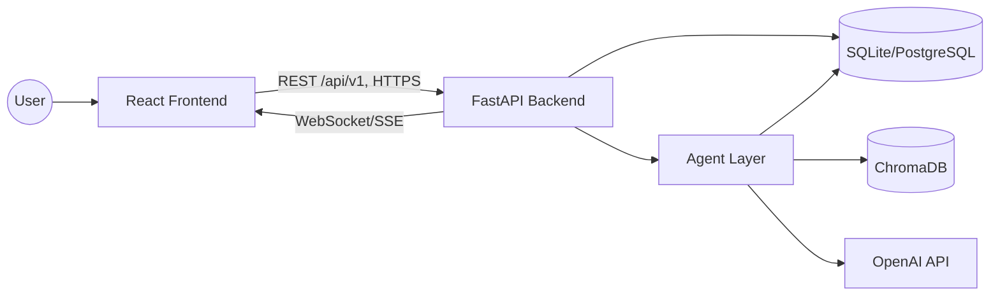
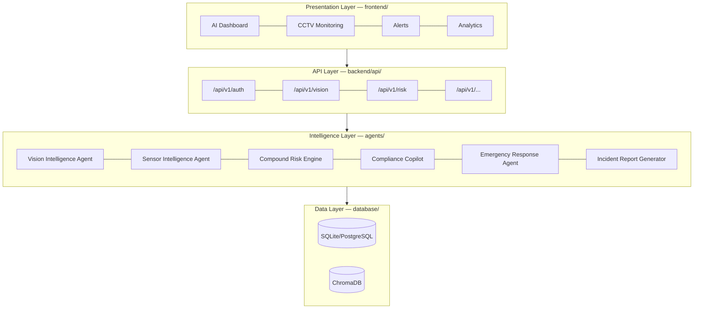
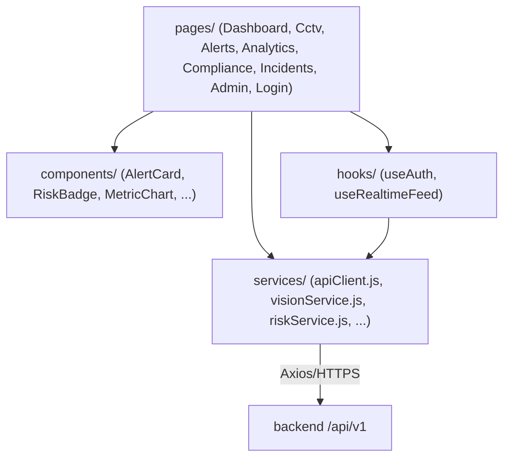
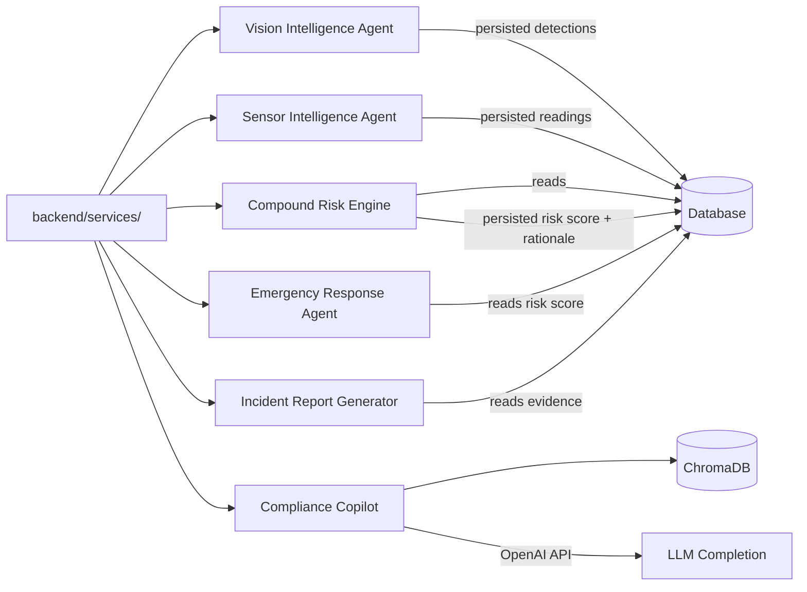
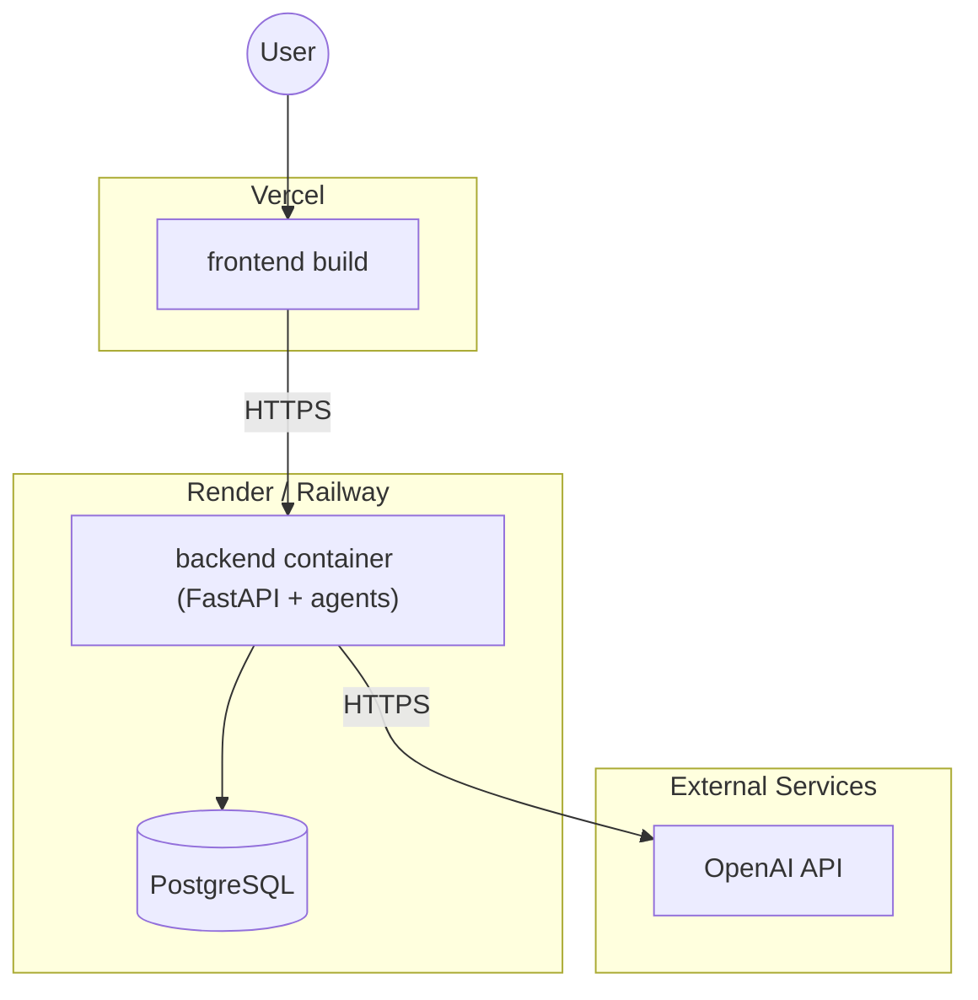

# 02_SYSTEM_ARCHITECTURE.md — System Architecture

| Field | Value |
|---|---|
| **Document** | 02_SYSTEM_ARCHITECTURE.md |
| **Version** | 1.0.0 |
| **Author** | SentinelAI Enterprise Architecture Team (Principal Solutions Architect, Enterprise Software Architect, AI Systems Architect) |
| **Purpose** | Define the complete technical architecture of SentinelAI for direct engineering implementation. |
| **Dependencies** | `docs/01_PRD.md`, `docs/PROJECT_MEMORY.md`, `docs/ARCHITECTURE_RULES.md`, `docs/CODING_STANDARDS.md` |
| **Status** | Draft — Hackathon Phase 1 |

### Revision History

| Version | Date | Author | Change |
|---|---|---|---|
| 1.0.0 | 2026-07-19 | Enterprise Architecture Team | Initial detailed system architecture |

---

## 1. System Overview

SentinelAI is a four-layer, agent-based system: a React presentation layer, a FastAPI API layer, a six-agent AI intelligence layer, and a dual data layer (relational + vector). The API layer is the only point of contact between the presentation layer and everything behind it, per `docs/ARCHITECTURE_RULES.md` Section 1.

## 2. Architecture Principles

Inherited verbatim from `docs/ARCHITECTURE_RULES.md` and `claude-prompts/00_MASTER_CONTEXT.md`: Modular Architecture, Explainable AI, Scalable Design, Clean Folder Structure, REST APIs, Production Ready, Enterprise Documentation, Professional UI/UX, Separation of Concerns, Maintainability.

Applied concretely:

- **No layer skipping**: frontend → backend → agents → data, always in that order (Section 3).
- **Single-responsibility agents**: each of the six agents owns exactly one concern (Section 5).
- **Explainability by construction**: every AI output persists its rationale alongside its result.
- **Stateless services**: backend and agent processes hold no session state in memory beyond a single request; all state lives in the data layer.

## 3. Layered Architecture

Layer responsibilities and dependency direction are frozen per `docs/ARCHITECTURE_RULES.md` Section 4 — a lower layer never depends on a higher layer.

## 4. Component Responsibilities

| Component | Folder | Responsibility |
|---|---|---|
| Frontend App | `frontend/` | Presentation, user interaction, data visualization |
| API Gateway | `backend/api/` | Route definitions, request validation, auth enforcement |
| Orchestration Services | `backend/services/` | Coordinates agent calls, applies business rules |
| Data Models | `backend/models/` | ORM/Pydantic models, DB access |
| Core Config | `backend/core/` | Configuration, security, startup, logging |
| Vision Intelligence Agent | `agents/vision_agent.py` | YOLOv8/OpenCV hazard detection from CCTV frames |
| Sensor Intelligence Agent | `agents/sensor_agent.py` | Sensor telemetry ingestion and anomaly detection |
| Compound Risk Engine | `agents/risk_engine.py` | Fuses Vision + Sensor signals into one explainable risk score |
| Compliance Copilot | `agents/compliance_copilot.py` | RAG Q&A over ingested regulations/SOPs via ChromaDB |
| Emergency Response Agent | `agents/emergency_agent.py` | Recommends emergency protocol on critical risk |
| Incident Report Generator | `agents/incident_generator.py` | Drafts structured incident reports from persisted evidence |
| Relational Database | `database/` | Source of truth for all structured entities |
| Vector Store | ChromaDB (managed by Compliance Copilot) | Embedding storage/retrieval for compliance documents |

## 5. Frontend Architecture

- **Stack**: React + Vite, TailwindCSS, React Router, Axios, Recharts (per `docs/PROJECT_MEMORY.md` Section 3).
- **Structure**: `frontend/src/{components,pages,services,hooks,context}`.
- **Pages**: `DashboardPage.jsx`, `CctvPage.jsx`, `AlertsPage.jsx`, `AnalyticsPage.jsx`, plus `CompliancePage.jsx`, `IncidentsPage.jsx`, `AdminPage.jsx`, `LoginPage.jsx` (extending the set defined in `docs/TASK_BOARD.md`).
- **Data flow**: components → `services/*.js` (Axios clients) → backend `/api/v1`. Components never call Axios directly (per `docs/CODING_STANDARDS.md` Section 2).
- **Real-time updates**: a shared `useRealtimeFeed` hook subscribes to the backend's WebSocket/SSE channel for live risk/alert state.
- **Role-aware rendering**: navigation and page access are gated by the authenticated user's role (`admin`, `safety_manager`, `site_operator`, `compliance_officer`, `viewer` — per `docs/01_PRD.md` Section 9).

## 6. Backend Architecture

- **Stack**: Python, FastAPI (async throughout, per `docs/CODING_STANDARDS.md` Section 1).
- **Structure**: `backend/{api,services,models,core}`.
- **`api/`**: thin route handlers; validate input via Pydantic, delegate to `services/`.
- **`services/`**: business logic and agent orchestration; the only layer permitted to call into `agents/`.
- **`models/`**: SQLAlchemy (or equivalent) ORM models mirroring `database/` schema, plus Pydantic request/response schemas.
- **`core/`**: `config.py` (pydantic-settings), `security.py` (JWT auth), `logging.py` (structured logging).
- **Response contract**: every endpoint returns the standard envelope `{ "success": bool, "data": ..., "error": ... }` (per `docs/CODING_STANDARDS.md` Section 6).

## 7. AI Layer

- **Stack**: YOLOv8, OpenCV, LangChain / LangGraph, OpenAI API, Sentence Transformers.
- Each agent in `agents/` exposes a single public entry point (e.g. `run(input) -> output`) and returns a result object that always includes a `rationale` field (Explainability principle).
- **LangGraph** orchestrates any multi-step agent reasoning (e.g. Compliance Copilot's retrieve → rank → generate → cite pipeline; Emergency Response Agent's threshold-check → protocol-match → recommend pipeline).
- Agents are invoked only by `backend/services/`, never by each other directly (per `docs/ARCHITECTURE_RULES.md` Section 8), and never by the frontend.

## 8. Database Layer

- **MVP**: SQLite. **Production target**: PostgreSQL. One shared, portable schema (no engine-specific types), per `docs/ARCHITECTURE_RULES.md` Section 7.
- **Core tables** (per `docs/PROJECT_MEMORY.md` Section 7): `users`, `sites`, `zones`, `cameras`, `sensors`, `detections`, `sensor_readings`, `risk_scores`, `incidents`, `alerts`, `compliance_documents`, `compliance_embeddings`, `emergency_protocols`, `audit_logs`.
- Every table has a UUID surrogate primary key and `created_at`/`updated_at` timestamps; all foreign keys explicit and indexed.
- Full ER diagram, relationships, and constraints are defined in a dedicated future `docs/DATABASE_SCHEMA.md` (tracked in `docs/ROADMAP.md` Phase 2) — this document defines only the architectural role of the data layer.

## 9. API Layer

- Base path: `/api/v1`. All request/response bodies validated via Pydantic.
- Resource endpoints (per `docs/PROJECT_MEMORY.md` Section 6): `/api/v1/auth`, `/api/v1/vision`, `/api/v1/sensors`, `/api/v1/risk`, `/api/v1/compliance`, `/api/v1/emergency`, `/api/v1/incidents`, `/api/v1/alerts`, `/api/v1/dashboard`, `/api/v1/analytics`, `/api/v1/cctv`.
- Authentication required on every endpoint except `/api/v1/auth/login` (JWT bearer, per Section 11).
- Endpoint names are frozen once shipped; breaking changes require `/api/v2` (never a rename), per `docs/PROJECT_MEMORY.md` Section 12.
- Full per-endpoint contracts (Endpoint, Purpose, Request, Response, Error Codes, Authentication, Validation, Example JSON) are defined in a future `docs/API_REFERENCE.md` (`docs/ROADMAP.md` Phase 2).

## 10. Deployment Layer

- **Containerization**: optional Docker images for `frontend/` and `backend/` (agents run in-process with the backend for MVP).
- **Hosting**: backend on Render/Railway; frontend on Vercel (per `docs/PROJECT_MEMORY.md` Section 3).
- **Environments**: `local` (SQLite, hot reload), `demo` (SQLite or PostgreSQL, deployed), `production` (PostgreSQL, target post-hackathon).

## 11. Security

- **Authentication**: JWT bearer tokens issued by `/api/v1/auth/login`; short-lived access token + refresh token pattern.
- **Authorization**: role-based access control enforced in `backend/api/` route dependencies, using the five roles defined in `docs/01_PRD.md` Section 9 (`admin`, `safety_manager`, `site_operator`, `compliance_officer`, `viewer`).
- **Secrets**: never hardcoded; loaded via `backend/core/config.py` from environment variables (`OPENAI_API_KEY`, DB connection string, JWT signing key).
- **Transport**: HTTPS enforced in all non-local environments.
- **Input validation**: all inputs validated via Pydantic before reaching services or agents.
- **Least privilege**: `viewer` role is read-only across every endpoint; `compliance_officer` cannot modify camera/sensor configuration; only `admin` manages users and sites.

## 12. Logging

- Centralized configuration in `backend/core/logging.py`; JSON-structured logs in non-local environments (per `docs/CODING_STANDARDS.md` Section 8).
- Every request carries a trace ID; agent calls propagate the same trace ID so a risk score can be traced end-to-end (camera frame → detection → risk score → alert → incident).
- Log levels: `DEBUG`, `INFO`, `WARNING`, `ERROR`, `CRITICAL` (safety-relevant failures, e.g. Vision Intelligence Agent offline).

## 13. Monitoring

- Health check endpoint (`/api/v1/health`, unauthenticated) reporting backend, database, and vector store connectivity.
- Agent-level heartbeat metrics: last successful run timestamp per agent, exposed to the AI Dashboard's system status panel.
- Alert-on-failure: if the Vision Intelligence Agent or Sensor Intelligence Agent misses N consecutive expected runs, the backend raises an internal `CRITICAL` log and a dashboard system alert (distinct from safety alerts).

## 14. Performance

- Target end-to-end latency (camera frame → dashboard alert): under 5 seconds in the demo environment (per `docs/01_PRD.md` Section 14).
- Async I/O throughout the backend and agents to avoid blocking on OpenAI API or ChromaDB calls.
- Database connection pooling from day one, even against SQLite-compatible code paths, to ease the PostgreSQL transition (per `docs/ARCHITECTURE_RULES.md` Section 9).
- Frontend: paginated Analytics queries; Recharts data windowed to avoid over-fetching historical data.

## 15. Fault Tolerance

- If the Vision Intelligence Agent fails on a given frame, the Compound Risk Engine falls back to Sensor-only risk scoring and flags reduced confidence in its rationale — it never silently fails.
- If the Compliance Copilot cannot retrieve a relevant document, it returns an explicit "insufficient information" response rather than fabricating an answer (per `docs/ARCHITECTURE_RULES.md` Section 8).
- Backend endpoints return the standard error envelope (`docs/CODING_STANDARDS.md` Section 7) on any agent failure, with a machine-readable `error.code` so the frontend can degrade gracefully rather than crash.
- Database writes for safety-critical events (`risk_scores`, `incidents`, `alerts`) are wrapped in transactions; partial writes are never left in a committed state.

## 16. Future Expansion

- Split the Vision Intelligence Agent into an independently deployable edge service (dependency rules in `docs/ARCHITECTURE_RULES.md` Section 4 already keep agents decoupled from the backend process to support this).
- Introduce a message queue (e.g. Redis Streams/Kafka) between the Sensor Intelligence Agent and the Compound Risk Engine for higher sensor throughput.
- Multi-tenant data partitioning at the `sites` table level for organization-level isolation.
- Read replicas for PostgreSQL once Analytics query volume grows.

---

## Glossary

| Term | Definition |
|---|---|
| Layer | One of the four architectural tiers: Presentation, API, Intelligence, Data |
| Orchestration | Backend coordination of one or more agent calls to fulfill a request |
| Trace ID | Identifier propagated across a request to correlate logs end-to-end |
| RBAC | Role-Based Access Control |

## References

- `docs/01_PRD.md`, `docs/PROJECT_MEMORY.md`, `docs/ARCHITECTURE_RULES.md`, `docs/CODING_STANDARDS.md`, `docs/ROADMAP.md`

## Assumptions

- A JWT bearer + refresh token authentication scheme is assumed (not specified upstream at the time of writing); documented here as the authoritative decision, consistent with `docs/PROJECT_MEMORY.md` Section 11.
- A `/api/v1/health` endpoint is introduced as a reasonable engineering addition for monitoring; it does not appear in the original placeholder API list in `docs/PROJECT_MEMORY.md` and should be added there in a future update.

## Future Improvements

- Produce `docs/DATABASE_SCHEMA.md` and `docs/API_REFERENCE.md` as dedicated deep-dive documents (tracked in `docs/ROADMAP.md` Phase 2).
- Add a formal threat model once the platform handles real site data.
