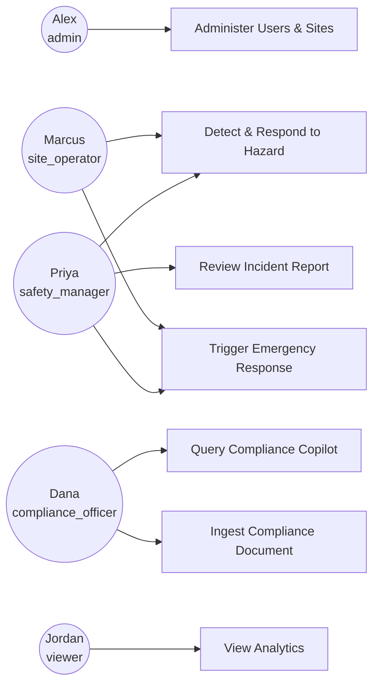
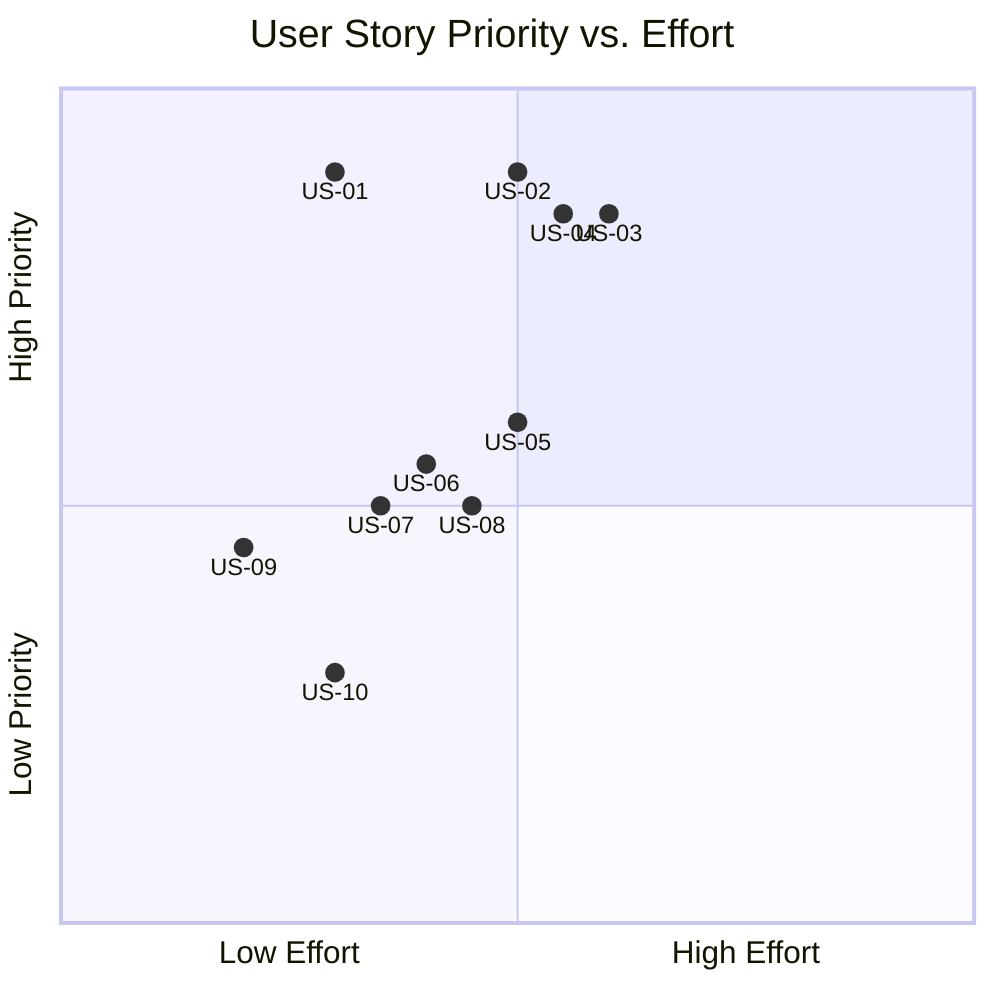

# 05_USER_STORIES_AND_USE_CASES.md — User Stories & Use Cases

| Field | Value |
|---|---|
| **Document** | 05_USER_STORIES_AND_USE_CASES.md |
| **Version** | 1.0.0 |
| **Author** | SentinelAI Enterprise Architecture Team (Business Analyst, Technical Product Owner, Principal Product Manager) |
| **Purpose** | Translate SentinelAI requirements into concrete user stories and use cases for design and QA. |
| **Dependencies** | `docs/01_PRD.md`, `docs/03_FUNCTIONAL_REQUIREMENTS.md` |
| **Status** | Draft — Hackathon Phase 1 |

### Revision History

| Version | Date | Author | Change |
|---|---|---|---|
| 1.0.0 | 2026-07-19 | Enterprise Architecture Team | Initial user stories and use cases |

---

## 1. User Personas

Reused verbatim from `docs/01_PRD.md` Section 9 — the authoritative persona/role set:

| Persona | Role Key |
|---|---|
| Alex — Platform Administrator | `admin` |
| Priya — Safety Manager | `safety_manager` |
| Marcus — Site Operator | `site_operator` |
| Dana — Compliance Officer | `compliance_officer` |
| Jordan — Executive/Auditor | `viewer` |

## 2. Actor Diagram

## 3. Use Cases

### UC-01 — Detect and Alert on Safety Hazard

- **Actors**: `site_operator`, `safety_manager`
- **Description**: The system detects a hazard via the Vision/Sensor Intelligence Agents, computes a compound risk score, and alerts the operator/manager.
- **Preconditions**: Camera/sensor registered and active; user authenticated.
- **Happy Path**:
  1. Vision Intelligence Agent detects a PPE violation.
  2. Sensor Intelligence Agent reports a correlated anomaly.
  3. Compound Risk Engine fuses both signals into a risk score (High).
  4. AI Dashboard displays the alert in real time.
  5. `site_operator` acknowledges the alert.
- **Alternative Flow**: Only a Vision signal is present (no correlated sensor anomaly) — Compound Risk Engine scores using Vision alone at reduced confidence (per FR-RISK-004).
- **Exception Flow**: Vision Intelligence Agent is offline — Sensor-only fallback scoring applies; a system status alert is raised separately (per `docs/02_SYSTEM_ARCHITECTURE.md` §15).
- **Postconditions**: Alert recorded in `alerts`; risk score recorded in `risk_scores` with rationale.
- **Related Requirements**: FR-VIS-001/002, FR-RISK-001/002, FR-ALT-001/002.

### UC-02 — Query the Compliance Copilot

- **Actors**: `compliance_officer` (primary), `safety_manager` (secondary)
- **Description**: A user asks a natural-language compliance question and receives a cited answer.
- **Preconditions**: At least one document ingested into `compliance_documents`/ChromaDB.
- **Happy Path**:
  1. User submits a question via the Compliance module.
  2. Compliance Copilot retrieves relevant document chunks from ChromaDB.
  3. Compliance Copilot generates an answer via the OpenAI API, grounded in retrieved chunks.
  4. Answer displayed with citation(s).
- **Alternative Flow**: Multiple relevant documents found — Copilot cites the most relevant and notes the others.
- **Exception Flow**: No relevant document found — Copilot returns an explicit "insufficient information" response (per FR-COMP-002).
- **Postconditions**: Query and answer logged to `audit_logs` (per FR-COMP-004).
- **Related Requirements**: FR-COMP-001/002/004.

### UC-03 — Trigger Emergency Response

- **Actors**: `safety_manager`, `site_operator`
- **Description**: A Critical risk score triggers an Emergency Response Agent recommendation.
- **Preconditions**: Risk score computed and classified Critical (FR-RISK-003).
- **Happy Path**:
  1. Compound Risk Engine outputs a Critical risk score.
  2. Alert with `severity = Critical` created (FR-ALT-001), automatically notifying the Emergency Response Agent (FR-ALT-004).
  3. Emergency Response Agent matches the situation to a protocol in `emergency_protocols`.
  4. Recommendation with step-by-step instructions surfaces on the AI Dashboard/Alerts view.
  5. `site_operator`/`safety_manager` follows the recommended protocol.
- **Alternative Flow**: No exact protocol match — Emergency Response Agent recommends the closest matching general protocol and flags low match confidence in its rationale.
- **Exception Flow**: No protocols configured for the site — Emergency Response Agent returns an explicit gap notice rather than a fabricated protocol.
- **Postconditions**: Recommendation persisted with reference to the triggering risk score.
- **Related Requirements**: FR-EMR-001–004.

### UC-04 — Review and Approve an Incident Report

- **Actors**: `safety_manager`, `admin`
- **Description**: The Incident Report Generator drafts a report after an emergency event; a manager reviews and approves it.
- **Preconditions**: An Emergency Response Agent recommendation exists (UC-03 completed).
- **Happy Path**:
  1. Incident Report Generator drafts a structured report referencing all contributing evidence (FR-REP-001).
  2. Report appears in the Reports module with `status: draft`.
  3. `safety_manager` reviews the report and sets `status: approved` (FR-REP-004).
  4. Report becomes exportable (PDF/Markdown).
- **Alternative Flow**: Manager edits report details before approval (evidence references remain read-only per FR-REP-003).
- **Exception Flow**: Evidence incomplete (e.g. missing sensor reading) — report generator flags the gap explicitly in the draft rather than omitting it silently.
- **Postconditions**: Approved report is immutable and available for audit/export.
- **Related Requirements**: FR-REP-001–004.

### UC-05 — Administer Users and Sites

- **Actors**: `admin`
- **Description**: Platform administrator manages users, sites, zones, cameras, and sensors.
- **Preconditions**: User authenticated with `admin` role.
- **Happy Path**:
  1. Admin creates a new site and zones.
  2. Admin registers cameras/sensors and assigns them to zones.
  3. Admin invites a new user and assigns a role.
  4. All actions logged to `audit_logs`.
- **Alternative Flow**: Admin deactivates a user instead of deleting (preserves audit history, per FR-ADM-001).
- **Exception Flow**: Attempt to assign a camera to a nonexistent zone — request rejected with a validation error (standard error envelope).
- **Postconditions**: Site/zone/camera/sensor/user records available system-wide.
- **Related Requirements**: FR-ADM-001–005.

### UC-06 — Ingest a Compliance Document

- **Actors**: `compliance_officer`, `admin`
- **Description**: A new regulatory/SOP document is added to the Compliance Copilot's knowledge base.
- **Preconditions**: User authenticated with `compliance_officer` or `admin` role.
- **Happy Path**:
  1. User uploads a document.
  2. Document is chunked and embedded, stored in ChromaDB, and a `compliance_documents` row created.
  3. Document becomes queryable via UC-02 within 60s (FR-COMP-003).
- **Alternative Flow**: Document replaces an existing version — old embeddings are superseded, not silently duplicated.
- **Exception Flow**: Unsupported file format — upload rejected with a clear error message.
- **Postconditions**: Compliance Copilot's answers may now cite the new document.
- **Related Requirements**: FR-COMP-003.

### UC-07 — View Analytics

- **Actors**: `viewer`, `safety_manager`, `admin`
- **Description**: A stakeholder reviews historical trends and compliance posture.
- **Preconditions**: User authenticated; historical data exists.
- **Happy Path**:
  1. User opens the Analytics module.
  2. User selects a time range and site/zone filter.
  3. Risk trend, incident frequency, and compliance posture charts render.
- **Alternative Flow**: User exports the filtered view (P3/future scope, FR-ANL-005).
- **Exception Flow**: No data for the selected range — module displays an explicit empty state, not a blank/broken chart.
- **Postconditions**: None (read-only).
- **Related Requirements**: FR-ANL-001–004.

## 4. User Stories

| ID | As a... | I want to... | So that... | Priority |
|---|---|---|---|---|
| US-01 | `site_operator` | see real-time hazard alerts on the AI Dashboard | I can respond before an incident escalates | P0 |
| US-02 | `safety_manager` | understand why a risk score is elevated | I can trust and act on the AI's recommendation | P0 |
| US-03 | `compliance_officer` | ask compliance questions in plain language and get cited answers | I can respond to audits quickly and accurately | P0 |
| US-04 | `safety_manager` | receive an emergency protocol recommendation automatically | my team responds correctly without hunting for a paper manual | P0 |
| US-05 | `safety_manager` | have an incident report drafted automatically | I save time on post-incident paperwork | P1 |
| US-06 | `admin` | manage users, sites, and devices in one place | I can onboard a new site quickly | P1 |
| US-07 | `viewer` | see historical safety and compliance trends | I can report to leadership/regulators | P1 |
| US-08 | `compliance_officer` | upload new regulations/SOPs | the Compliance Copilot stays current | P1 |
| US-09 | `site_operator` | acknowledge alerts | my team knows an alert is being handled | P1 |
| US-10 | `admin` | see an audit log of all administrative actions | I can investigate any unexpected system change | P2 |

## 5. Priority Matrix

## 6. Acceptance Criteria (Cross-Reference)

All acceptance criteria for the use cases and user stories above are formalized as functional requirements in `docs/03_FUNCTIONAL_REQUIREMENTS.md`. This document intentionally does not duplicate acceptance-criteria text — see the FR ID references in each use case's "Related Requirements" line.

---

## Glossary

| Term | Definition |
|---|---|
| Use Case | A goal-oriented interaction between an actor and the system |
| User Story | A short, persona-framed statement of a need, used for backlog planning |
| Actor | A role (persona) that interacts with the system |

## References

- `docs/01_PRD.md`, `docs/03_FUNCTIONAL_REQUIREMENTS.md`

## Assumptions

- Priority Matrix effort/priority values are qualitative estimates for planning purposes, not measured story points.

## Future Improvements

- Add use cases for the Future Scope items in `docs/01_PRD.md` §12 (mobile app, multi-tenant) once those phases begin.
