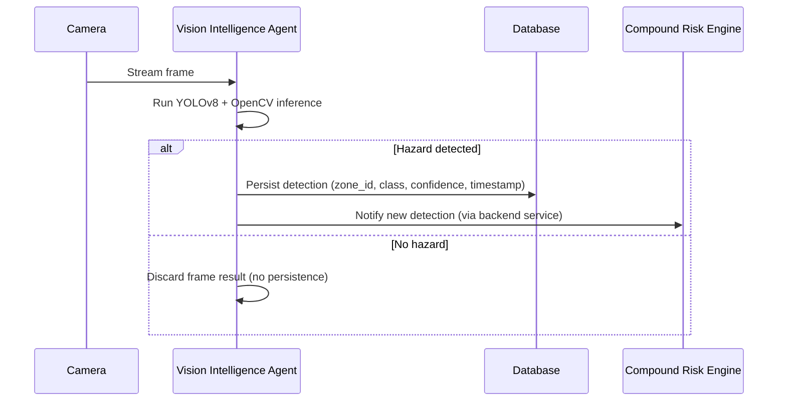
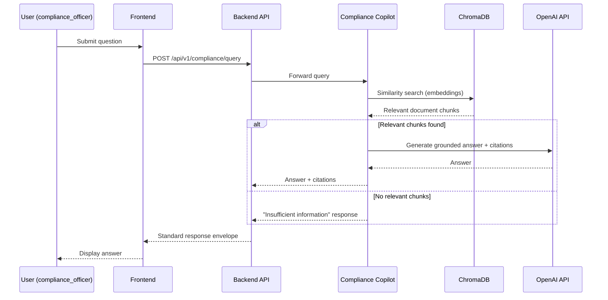
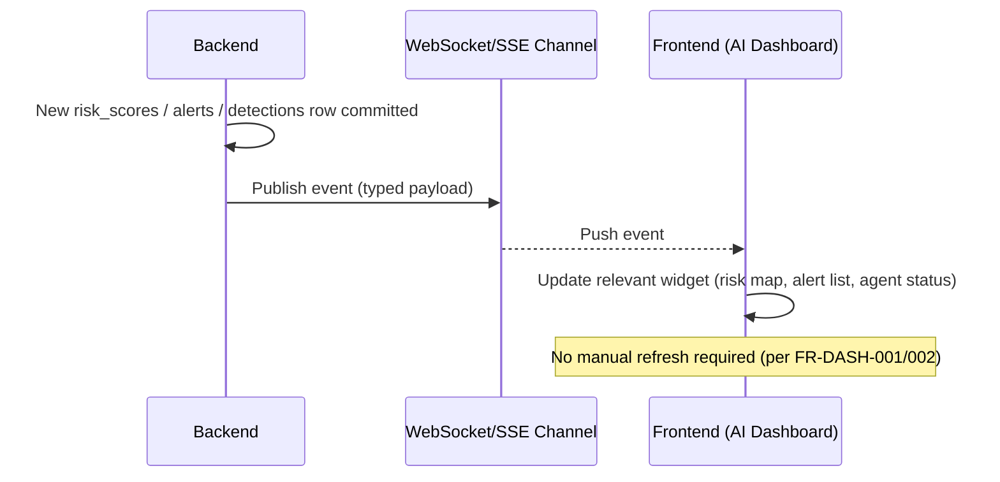
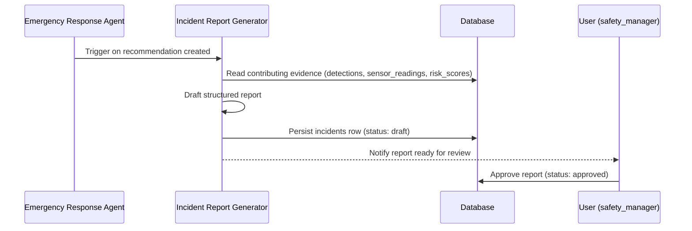
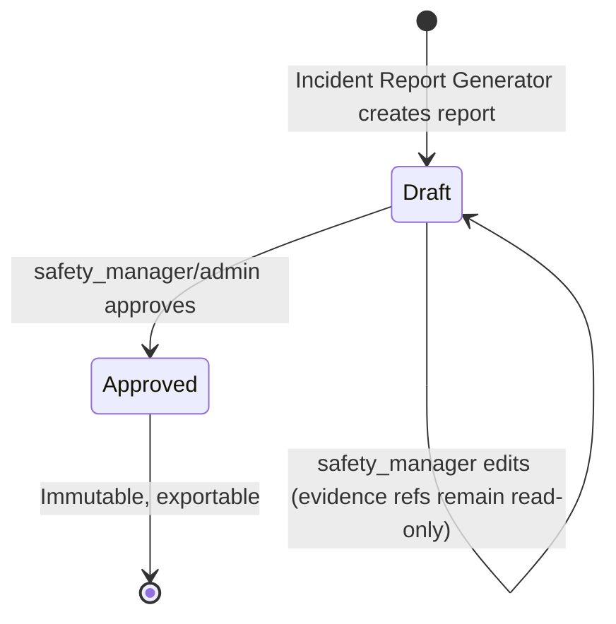
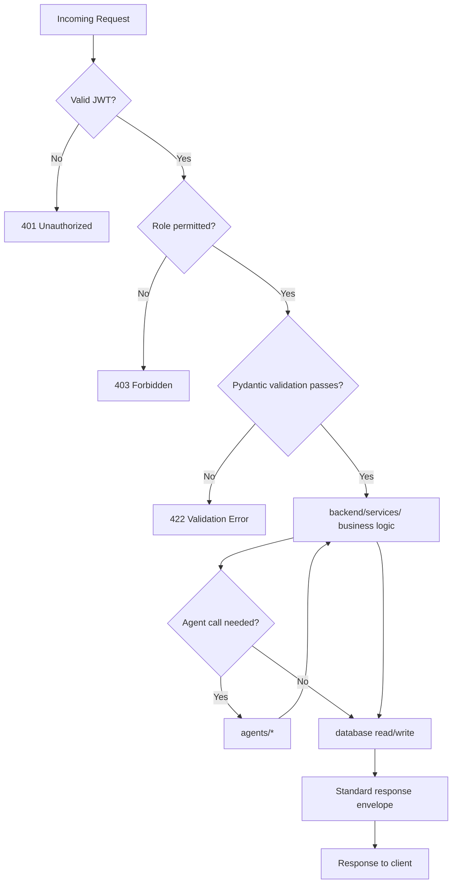

# 06_SYSTEM_WORKFLOW.md — System Workflows

| Field | Value |
|---|---|
| **Document** | 06_SYSTEM_WORKFLOW.md |
| **Version** | 1.0.0 |
| **Author** | SentinelAI Enterprise Architecture Team (AI Systems Architect, Enterprise Software Architect) |
| **Purpose** | Define the complete end-to-end workflows of SentinelAI as implementation-ready diagrams. |
| **Dependencies** | `docs/02_SYSTEM_ARCHITECTURE.md`, `docs/03_FUNCTIONAL_REQUIREMENTS.md` |
| **Status** | Draft — Hackathon Phase 1 |

### Revision History

| Version | Date | Author | Change |
|---|---|---|---|
| 1.0.0 | 2026-07-19 | Enterprise Architecture Team | Initial workflow set |

---

## 1. Camera Detection Workflow



Related: FR-VIS-001–005.

## 2. Risk Analysis Workflow

```mermaid
sequenceDiagram
    participant VIA as Vision Intelligence Agent
    participant SIA as Sensor Intelligence Agent
    participant CRE as Compound Risk Engine
    participant DB as Database
    participant ALT as Alerts Module

    VIA-->>CRE: Latest detections (zone)
    SIA-->>CRE: Latest sensor readings (zone)
    CRE->>CRE: Fuse signals, compute score + rationale
    CRE->>DB: Persist risk_scores row
    CRE->>ALT: If threshold crossed, request alert creation
    ALT->>DB: Persist alerts row
    ALT-->>Dashboard: Push via WebSocket/SSE
```

Related: FR-RISK-001–004, FR-ALT-001.

## 3. Compliance Query Workflow



Related: FR-COMP-001/002.

## 4. Emergency Response Workflow

```mermaid
sequenceDiagram
    participant CRE as Compound Risk Engine
    participant ALT as Alerts Module
    participant ERA as Emergency Response Agent
    participant DB as Database
    participant U as User (site_operator / safety_manager)

    CRE->>ALT: Critical risk score
    ALT->>DB: Persist Critical alert
    ALT->>ERA: Notify (auto-trigger)
    ERA->>DB: Match emergency_protocols for zone/hazard type
    alt Protocol match found
        ERA->>DB: Persist recommendation
        ERA-->>U: Push recommendation + steps
    else No match
        ERA-->>U: Push nearest-general-protocol recommendation with low-confidence flag
    end
```

Related: FR-EMR-001–004, FR-ALT-004.

## 5. Dashboard Update Workflow



Related: FR-DASH-001–003.

## 6. Incident Creation Workflow





Related: FR-REP-001–004.

## 7. Authentication Workflow

```mermaid
sequenceDiagram
    participant U as User
    participant FE as Frontend
    participant BE as Backend
    participant DB as Database

    U->>FE: Enter email/password
    FE->>BE: POST /api/v1/auth/login
    BE->>DB: Verify credentials (hashed)
    alt Valid credentials
        BE-->>FE: Access token (JWT) + refresh token
        FE->>FE: Store tokens, redirect to role-appropriate view
    else Invalid credentials
        BE-->>FE: 401 (standard error envelope)
    end
    Note over FE,BE: Subsequent requests include Bearer token; refresh via /api/v1/auth/refresh
```

Related: FR-AUTH-001–005.

## 8. API Flow (Generic Request Lifecycle)



Related: `docs/CODING_STANDARDS.md` §6/7, `docs/02_SYSTEM_ARCHITECTURE.md` §9/11.

---

## Glossary

| Term | Definition |
|---|---|
| Workflow | An ordered sequence of system/actor interactions fulfilling one functional requirement set |
| Envelope | The standard `{success, data, error}` API response shape |

## References

- `docs/02_SYSTEM_ARCHITECTURE.md`, `docs/03_FUNCTIONAL_REQUIREMENTS.md`

## Assumptions

- WebSocket/SSE is assumed as the real-time delivery mechanism (per `docs/02_SYSTEM_ARCHITECTURE.md` §5); exact protocol choice is deferred to backend implementation.

## Future Improvements

- Add workflow diagrams for Administration (UC-05/UC-06 in `docs/05_USER_STORIES_AND_USE_CASES.md`) once admin UI is implemented.
- Add failure-path sequence diagrams (timeouts, retries) once real latency data is available.
