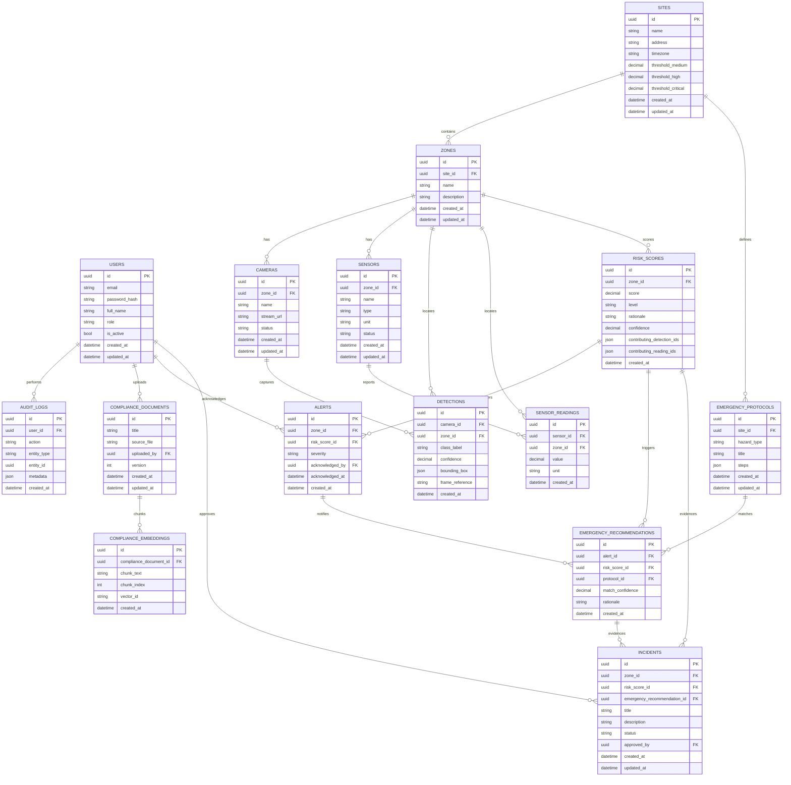

# 07_DATABASE_DESIGN.md — Database Design

| Field | Value |
|---|---|
| **Document** | 07_DATABASE_DESIGN.md |
| **Version** | 1.0.0 |
| **Author** | SentinelAI Enterprise Engineering Team (Principal Database Architect) |
| **Purpose** | Define the complete, implementation-ready database schema for SentinelAI. |
| **Dependencies** | `docs/PROJECT_MEMORY.md` §7/§14, `docs/ARCHITECTURE_RULES.md` §7, `docs/02_SYSTEM_ARCHITECTURE.md` §8 |
| **Status** | Draft — Hackathon Phase 2 |

### Revision History

| Version | Date | Author | Change |
|---|---|---|---|
| 1.0.0 | 2026-07-19 | Enterprise Engineering Team | Initial complete schema |

---

## 1. Database Overview

SentinelAI uses one relational schema across two engines: **SQLite** for local development and the hackathon MVP, and **PostgreSQL** as the production target (per `docs/PROJECT_MEMORY.md` §3). A dedicated vector store, **ChromaDB**, holds Compliance Copilot embeddings and is referenced from the relational schema via `compliance_embeddings.vector_id`, but is not itself a relational database.

## 2. Database Philosophy

- **One portable schema** — no SQLite-only or PostgreSQL-only column types (per `docs/ARCHITECTURE_RULES.md` §7).
- **Additive evolution** — columns/tables are added, never destructively altered, without a documented migration and rollback path.
- **Explainability at the data layer** — every AI-generated row (`detections`, `risk_scores`, `emergency_recommendations`, `incidents`) persists its rationale/evidence references, not just its output.
- **Append-only for safety-critical history** — `risk_scores`, `detections`, `sensor_readings`, `alerts`, and `audit_logs` rows are never deleted or mutated after creation (per FR-RISK-005).
- **UUID surrogate keys** — every table uses a UUID primary key (`id`), decoupling public identifiers from row order and easing multi-database portability.

## 3. Normalization Strategy

The schema is normalized to **Third Normal Form (3NF)** for all transactional entities (`users`, `sites`, `zones`, `cameras`, `sensors`, `emergency_protocols`, `compliance_documents`). Append-only evidence and event tables (`detections`, `sensor_readings`, `risk_scores`, `alerts`, `incidents`, `emergency_recommendations`, `audit_logs`) are intentionally denormalized where it avoids expensive joins on hot read paths (e.g. `risk_scores.rationale` stores a human-readable snapshot rather than requiring a join-time reconstruction), consistent with the Performance principles in `docs/04_NON_FUNCTIONAL_REQUIREMENTS.md` §1.

Many-to-many evidence links (a risk score can be produced from multiple detections/readings) are modeled as JSON arrays of foreign-key UUIDs (`risk_scores.contributing_detection_ids`, `risk_scores.contributing_reading_ids`) rather than junction tables, to keep the append-only event tables simple and portable across SQLite's JSON1 extension and PostgreSQL's native `JSON`/`JSONB` type. This is documented as an explicit engineering tradeoff in Section 11 (Assumptions).

## 4. Entity Relationship Diagram



## 5. Table Definitions

Naming, typing, and constraint conventions follow `docs/CODING_STANDARDS.md` §3/§6 (`snake_case`, plural table names).

### 5.1 `users`

| Column | Type | Constraints |
|---|---|---|
| `id` | UUID | PK |
| `email` | VARCHAR(255) | UNIQUE, NOT NULL |
| `password_hash` | VARCHAR(255) | NOT NULL |
| `full_name` | VARCHAR(255) | NOT NULL |
| `role` | VARCHAR(32) | NOT NULL, CHECK IN (`admin`,`safety_manager`,`site_operator`,`compliance_officer`,`viewer`) |
| `is_active` | BOOLEAN | NOT NULL, DEFAULT TRUE |
| `created_at` | DATETIME | NOT NULL |
| `updated_at` | DATETIME | NOT NULL |

Indexes: UNIQUE(`email`); INDEX(`role`).

Sample record:
```json
{ "id": "b3b1...e1", "email": "priya@sentinelai.demo", "full_name": "Priya Shah", "role": "safety_manager", "is_active": true, "created_at": "2026-07-19T09:00:00Z" }
```

### 5.2 `sites`

| Column | Type | Constraints |
|---|---|---|
| `id` | UUID | PK |
| `name` | VARCHAR(255) | NOT NULL |
| `address` | VARCHAR(500) | NULL |
| `timezone` | VARCHAR(64) | NOT NULL, DEFAULT `UTC` |
| `threshold_medium` | DECIMAL(5,2) | NOT NULL, DEFAULT 40.00 |
| `threshold_high` | DECIMAL(5,2) | NOT NULL, DEFAULT 70.00 |
| `threshold_critical` | DECIMAL(5,2) | NOT NULL, DEFAULT 90.00 |
| `created_at` | DATETIME | NOT NULL |
| `updated_at` | DATETIME | NOT NULL |

Indexes: INDEX(`name`). Supports FR-ADM-004 (per-site configurable thresholds).

### 5.3 `zones`

| Column | Type | Constraints |
|---|---|---|
| `id` | UUID | PK |
| `site_id` | UUID | FK → `sites.id`, NOT NULL |
| `name` | VARCHAR(255) | NOT NULL |
| `description` | VARCHAR(500) | NULL |
| `created_at` | DATETIME | NOT NULL |
| `updated_at` | DATETIME | NOT NULL |

Indexes: INDEX(`site_id`).

### 5.4 `cameras`

| Column | Type | Constraints |
|---|---|---|
| `id` | UUID | PK |
| `zone_id` | UUID | FK → `zones.id`, NOT NULL |
| `name` | VARCHAR(255) | NOT NULL |
| `stream_url` | VARCHAR(500) | NOT NULL |
| `status` | VARCHAR(32) | NOT NULL, CHECK IN (`active`,`inactive`,`offline`), DEFAULT `active` |
| `created_at` | DATETIME | NOT NULL |
| `updated_at` | DATETIME | NOT NULL |

Indexes: INDEX(`zone_id`), INDEX(`status`).

### 5.5 `sensors`

| Column | Type | Constraints |
|---|---|---|
| `id` | UUID | PK |
| `zone_id` | UUID | FK → `zones.id`, NOT NULL |
| `name` | VARCHAR(255) | NOT NULL |
| `type` | VARCHAR(32) | NOT NULL, CHECK IN (`gas`,`temperature`,`vibration`,`pressure`) |
| `unit` | VARCHAR(16) | NOT NULL |
| `status` | VARCHAR(32) | NOT NULL, CHECK IN (`active`,`inactive`,`offline`), DEFAULT `active` |
| `created_at` | DATETIME | NOT NULL |
| `updated_at` | DATETIME | NOT NULL |

Indexes: INDEX(`zone_id`), INDEX(`type`).

### 5.6 `detections`

| Column | Type | Constraints |
|---|---|---|
| `id` | UUID | PK |
| `camera_id` | UUID | FK → `cameras.id`, NOT NULL |
| `zone_id` | UUID | FK → `zones.id`, NOT NULL |
| `class_label` | VARCHAR(64) | NOT NULL (e.g. `ppe_violation`, `intrusion`, `fire`, `smoke`, `unsafe_operation`) |
| `confidence` | DECIMAL(5,4) | NOT NULL, CHECK BETWEEN 0 AND 1 |
| `bounding_box` | JSON | NOT NULL — `{x, y, width, height}` |
| `frame_reference` | VARCHAR(500) | NOT NULL — pointer to stored frame/clip |
| `created_at` | DATETIME | NOT NULL |

Indexes: INDEX(`zone_id`, `created_at`), INDEX(`camera_id`), INDEX(`class_label`). Append-only (per FR-VIS-005).

Sample record:
```json
{ "id": "d1a2...", "camera_id": "c1a2...", "zone_id": "z1a2...", "class_label": "ppe_violation", "confidence": 0.94, "bounding_box": {"x": 120, "y": 80, "width": 60, "height": 140}, "frame_reference": "frames/2026-07-19/z1a2/000123.jpg", "created_at": "2026-07-19T10:15:03Z" }
```

### 5.7 `sensor_readings`

| Column | Type | Constraints |
|---|---|---|
| `id` | UUID | PK |
| `sensor_id` | UUID | FK → `sensors.id`, NOT NULL |
| `zone_id` | UUID | FK → `zones.id`, NOT NULL |
| `value` | DECIMAL(10,4) | NOT NULL |
| `unit` | VARCHAR(16) | NOT NULL |
| `created_at` | DATETIME | NOT NULL |

Indexes: INDEX(`zone_id`, `created_at`), INDEX(`sensor_id`). Append-only.

### 5.8 `risk_scores`

| Column | Type | Constraints |
|---|---|---|
| `id` | UUID | PK |
| `zone_id` | UUID | FK → `zones.id`, NOT NULL |
| `score` | DECIMAL(5,2) | NOT NULL, CHECK BETWEEN 0 AND 100 |
| `level` | VARCHAR(16) | NOT NULL, CHECK IN (`Low`,`Medium`,`High`,`Critical`) |
| `rationale` | TEXT | NOT NULL (per FR-RISK-002, never NULL) |
| `confidence` | VARCHAR(16) | NOT NULL, CHECK IN (`full`,`reduced`) — `reduced` when Vision-unavailable fallback applies (FR-RISK-004) |
| `contributing_detection_ids` | JSON | NULL — array of `detections.id` |
| `contributing_reading_ids` | JSON | NULL — array of `sensor_readings.id` |
| `created_at` | DATETIME | NOT NULL |

Indexes: INDEX(`zone_id`, `created_at`), INDEX(`level`). Append-only (per FR-RISK-005).

### 5.9 `alerts`

| Column | Type | Constraints |
|---|---|---|
| `id` | UUID | PK |
| `zone_id` | UUID | FK → `zones.id`, NOT NULL |
| `risk_score_id` | UUID | FK → `risk_scores.id`, NOT NULL |
| `severity` | VARCHAR(16) | NOT NULL, CHECK IN (`Low`,`Medium`,`High`,`Critical`) |
| `acknowledged_by` | UUID | FK → `users.id`, NULL |
| `acknowledged_at` | DATETIME | NULL |
| `created_at` | DATETIME | NOT NULL |

Indexes: INDEX(`zone_id`, `created_at`), INDEX(`severity`), INDEX(`acknowledged_by`).

### 5.10 `emergency_protocols`

| Column | Type | Constraints |
|---|---|---|
| `id` | UUID | PK |
| `site_id` | UUID | FK → `sites.id`, NOT NULL |
| `hazard_type` | VARCHAR(64) | NOT NULL |
| `title` | VARCHAR(255) | NOT NULL |
| `steps` | JSON | NOT NULL — ordered array of instruction strings |
| `created_at` | DATETIME | NOT NULL |
| `updated_at` | DATETIME | NOT NULL |

Indexes: INDEX(`site_id`, `hazard_type`).

### 5.11 `emergency_recommendations`

| Column | Type | Constraints |
|---|---|---|
| `id` | UUID | PK |
| `alert_id` | UUID | FK → `alerts.id`, NOT NULL |
| `risk_score_id` | UUID | FK → `risk_scores.id`, NOT NULL |
| `protocol_id` | UUID | FK → `emergency_protocols.id`, NULL (NULL = no match found) |
| `match_confidence` | DECIMAL(5,4) | NOT NULL |
| `rationale` | TEXT | NOT NULL |
| `created_at` | DATETIME | NOT NULL |

Indexes: INDEX(`alert_id`), INDEX(`risk_score_id`). Supports FR-EMR-001–004 and the Emergency Response Workflow (`docs/06_SYSTEM_WORKFLOW.md` §4).

### 5.12 `incidents`

| Column | Type | Constraints |
|---|---|---|
| `id` | UUID | PK |
| `zone_id` | UUID | FK → `zones.id`, NOT NULL |
| `risk_score_id` | UUID | FK → `risk_scores.id`, NOT NULL |
| `emergency_recommendation_id` | UUID | FK → `emergency_recommendations.id`, NULL |
| `title` | VARCHAR(255) | NOT NULL |
| `description` | TEXT | NOT NULL |
| `status` | VARCHAR(16) | NOT NULL, CHECK IN (`draft`,`approved`), DEFAULT `draft` |
| `approved_by` | UUID | FK → `users.id`, NULL |
| `created_at` | DATETIME | NOT NULL |
| `updated_at` | DATETIME | NOT NULL |

Indexes: INDEX(`zone_id`, `created_at`), INDEX(`status`). Evidence fields (`risk_score_id`, `emergency_recommendation_id`) are read-only after creation (per FR-REP-003).

### 5.13 `compliance_documents`

| Column | Type | Constraints |
|---|---|---|
| `id` | UUID | PK |
| `title` | VARCHAR(255) | NOT NULL |
| `source_file` | VARCHAR(500) | NOT NULL |
| `uploaded_by` | UUID | FK → `users.id`, NOT NULL |
| `version` | INTEGER | NOT NULL, DEFAULT 1 |
| `created_at` | DATETIME | NOT NULL |
| `updated_at` | DATETIME | NOT NULL |

Indexes: INDEX(`title`).

### 5.14 `compliance_embeddings`

| Column | Type | Constraints |
|---|---|---|
| `id` | UUID | PK |
| `compliance_document_id` | UUID | FK → `compliance_documents.id`, NOT NULL |
| `chunk_text` | TEXT | NOT NULL |
| `chunk_index` | INTEGER | NOT NULL |
| `vector_id` | VARCHAR(255) | NOT NULL — reference into ChromaDB collection |
| `created_at` | DATETIME | NOT NULL |

Indexes: INDEX(`compliance_document_id`), UNIQUE(`vector_id`).

### 5.15 `audit_logs`

| Column | Type | Constraints |
|---|---|---|
| `id` | UUID | PK |
| `user_id` | UUID | FK → `users.id`, NULL (NULL = system-generated action) |
| `action` | VARCHAR(64) | NOT NULL (e.g. `user.create`, `compliance.query`, `site.update`) |
| `entity_type` | VARCHAR(64) | NOT NULL |
| `entity_id` | UUID | NULL |
| `metadata` | JSON | NULL |
| `created_at` | DATETIME | NOT NULL |

Indexes: INDEX(`user_id`, `created_at`), INDEX(`entity_type`, `entity_id`). Append-only, never mutated (per NFR-COMP-001).

## 6. Relationships Summary

| Parent | Child | Cardinality |
|---|---|---|
| `sites` | `zones` | 1 → N |
| `sites` | `emergency_protocols` | 1 → N |
| `zones` | `cameras`, `sensors` | 1 → N |
| `cameras` | `detections` | 1 → N |
| `sensors` | `sensor_readings` | 1 → N |
| `zones` | `detections`, `sensor_readings`, `risk_scores` | 1 → N |
| `risk_scores` | `alerts`, `emergency_recommendations`, `incidents` | 1 → N |
| `alerts` | `emergency_recommendations` | 1 → N |
| `emergency_protocols` | `emergency_recommendations` | 1 → N |
| `emergency_recommendations` | `incidents` | 1 → N (optional) |
| `compliance_documents` | `compliance_embeddings` | 1 → N |
| `users` | `audit_logs`, `compliance_documents.uploaded_by`, `alerts.acknowledged_by`, `incidents.approved_by` | 1 → N |

## 7. Constraints Summary

- All FKs use `ON DELETE RESTRICT` by default (no cascading deletes on safety-critical evidence); `sites`/`zones`/`cameras`/`sensors` deactivation is soft (`status`/`is_active` flags), never a hard delete, to preserve historical evidence integrity.
- `risk_scores.score` bounded 0–100; `level` and `severity` enumerations are shared across `risk_scores`, `alerts` for consistent thresholding.
- `users.role` CHECK constraint enumerates exactly the five frozen role keys from `docs/PROJECT_MEMORY.md` §14.

## 8. Migration Strategy

- Migrations managed via Alembic (SQLAlchemy) against both SQLite and PostgreSQL targets.
- Every migration is additive-first: new tables/columns before any constraint tightening; destructive changes require an explicit deprecation window documented in `docs/PROJECT_MEMORY.md`.
- Local/demo environment: SQLite file, migrations applied on backend startup.
- Production: PostgreSQL, migrations applied via CI/CD pipeline step before deployment (per `docs/13_CONFIGURATION.md`).

## 9. Future PostgreSQL Migration Notes

- Replace SQLite `JSON` (TEXT-backed) columns with PostgreSQL native `JSONB` for indexable JSON queries (e.g. querying `emergency_protocols.steps`).
- Add GIN indexes on `JSONB` columns used in filtering (`risk_scores.contributing_detection_ids`) once query patterns are established under load.
- Introduce PostgreSQL read replicas for `risk_scores`/`incidents` Analytics queries once volume grows (per `docs/02_SYSTEM_ARCHITECTURE.md` §16).
- UUID generation shifts from application-level (SQLite has no native UUID type) to `gen_random_uuid()` (pgcrypto) at the database level.

---

## Glossary

| Term | Definition |
|---|---|
| Append-only | Rows are inserted but never updated or deleted after creation |
| Evidence reference | A foreign key or JSON array linking an AI output to the raw signals that produced it |

## References

- `docs/PROJECT_MEMORY.md`, `docs/ARCHITECTURE_RULES.md`, `docs/02_SYSTEM_ARCHITECTURE.md`, `docs/03_FUNCTIONAL_REQUIREMENTS.md`

## Assumptions

- `emergency_recommendations` is a new table, not present in the original placeholder list (`docs/PROJECT_MEMORY.md` §7 as of v1.1.0). It is required to persist Emergency Response Agent output per `docs/06_SYSTEM_WORKFLOW.md` §4 and FR-EMR-001. Propagated to `docs/PROJECT_MEMORY.md` as v1.2.0 (see consistency audit in `docs/13_CONFIGURATION.md`'s companion audit / `docs/PROJECT_MEMORY.md` Revision History).
- `sites.threshold_medium/high/critical` are new columns supporting FR-ADM-004/FR-RISK-003 (per-site configurable thresholds); not previously enumerated.
- Many-to-many evidence links use JSON arrays rather than junction tables, favoring schema simplicity over relational query-ability for the MVP; revisit if Analytics requires indexed evidence joins at scale.

## Future Improvements

- Introduce dedicated junction tables (`risk_score_detections`, `risk_score_sensor_readings`) if JSON-array evidence linking becomes a query bottleneck.
- Add a `sites.organization_id` column when multi-tenant support (Future Scope, `docs/01_PRD.md` §12) is implemented.
