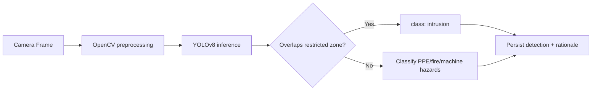
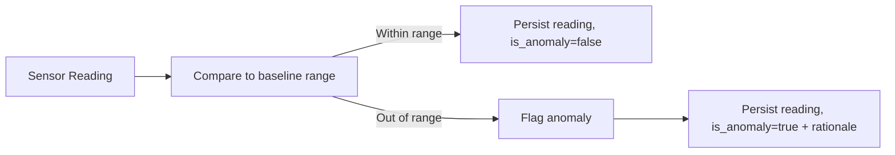
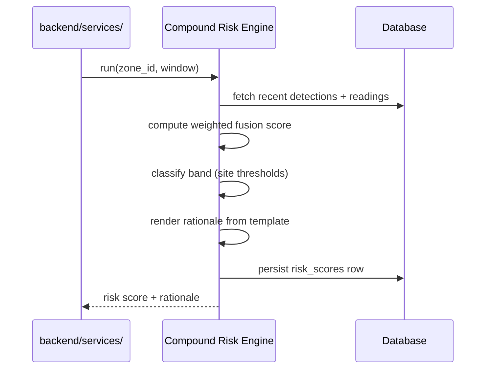
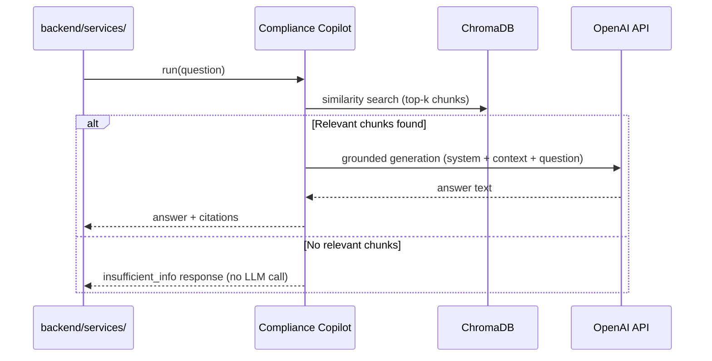
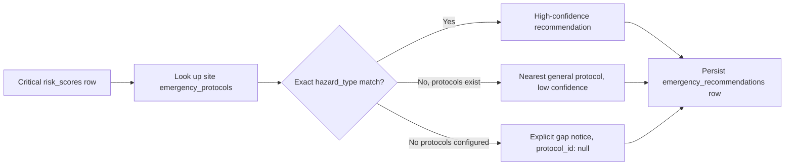
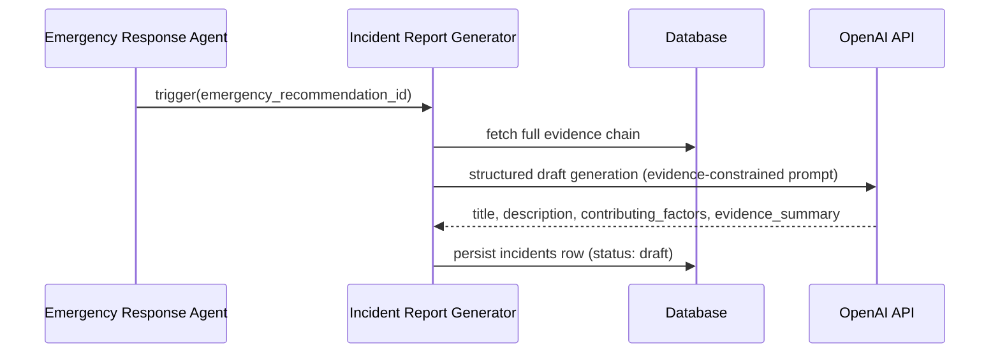

# 11_AI_ARCHITECTURE.md — AI Architecture

| Field | Value |
|---|---|
| **Document** | 11_AI_ARCHITECTURE.md |
| **Version** | 1.0.0 |
| **Author** | SentinelAI Enterprise Engineering Team (AI Platform Architect) |
| **Purpose** | Fully specify each of the six SentinelAI agents for implementation. |
| **Dependencies** | `docs/02_SYSTEM_ARCHITECTURE.md` §7, `docs/ARCHITECTURE_RULES.md` §8, `docs/07_DATABASE_DESIGN.md`, `docs/08_API_SPECIFICATION.md` |
| **Status** | Draft — Hackathon Phase 2 |

### Revision History

| Version | Date | Author | Change |
|---|---|---|---|
| 1.0.0 | 2026-07-19 | Enterprise Engineering Team | Initial AI architecture spec, all 6 agents |

All agents live under `agents/`, expose a single public `run(input) -> output` entry point, and always return a `rationale` field (Explainability principle, per `docs/ARCHITECTURE_RULES.md` §8/§11). No agent calls another agent directly — all cross-agent flow is via `backend/services/` (per `docs/ARCHITECTURE_RULES.md` §5).

---

## 1. Vision Intelligence Agent

**File**: `agents/vision_agent.py`

**Purpose**: Detect PPE violations, restricted-zone intrusion, fire/smoke, and unsafe machine operation from CCTV frames.

**Input**: A camera frame (image) reference plus zone metadata (restricted-zone polygons, machine-guard zones).
```json
{ "camera_id": "uuid", "zone_id": "uuid", "frame_path": "frames/2026-07-19/z1/000123.jpg", "zone_polygons": { "restricted": [[x,y],...] } }
```

**Output**: Zero or more detection objects, persisted via `POST /api/v1/vision/detections` (`docs/08_API_SPECIFICATION.md` §4).
```json
{ "detections": [ { "class_label": "ppe_violation", "confidence": 0.94, "bounding_box": {"x":120,"y":80,"width":60,"height":140} } ], "rationale": "Missing hard hat detected on person in frame region (120,80)-(180,220), confidence 0.94" }
```

**Dependencies**: YOLOv8 (object detection), OpenCV (frame preprocessing, polygon/zone overlap math). No LLM dependency.

**Model**: YOLOv8 (pretrained COCO base, fine-tuned on an industrial-safety class set: `helmet`, `no_helmet`, `vest`, `no_vest`, `person`, `fire`, `smoke`, `machine_guard_missing`). Inference runs synchronously per frame on a configurable sampling interval (not necessarily every frame, per Performance NFR-PERF-001).

**Prompt Templates**: Not applicable (computer vision model, not an LLM agent).

**Limitations**: Accuracy depends on camera angle/lighting; small/occluded objects may be missed; the model does not distinguish intent (e.g. a worker briefly removing a helmet vs. sustained non-compliance) — that nuance is deferred to the Compound Risk Engine's temporal aggregation.

**Failure Handling**: On inference failure (corrupt frame, model exception), the agent logs an `ERROR` and skips the frame — it never emits a fabricated detection. If failures persist beyond a configurable threshold, the agent reports `status: Degraded` to `GET /api/v1/dashboard/status`, and the Compound Risk Engine falls back to Sensor-only scoring (FR-RISK-004).

**Future Improvements**: Model fine-tuning on site-specific footage; edge deployment for lower latency (`docs/02_SYSTEM_ARCHITECTURE.md` §16).



---

## 2. Sensor Intelligence Agent

**File**: `agents/sensor_agent.py`

**Purpose**: Ingest and interpret industrial sensor telemetry (gas, temperature, vibration, pressure) and flag anomalies.

**Input**: Raw sensor reading plus the sensor's configured baseline/normal range.
```json
{ "sensor_id": "uuid", "zone_id": "uuid", "type": "gas", "value": 42.0, "unit": "ppm", "baseline_range": [0, 30] }
```

**Output**: Persisted reading, plus an anomaly flag when out of range.
```json
{ "reading_id": "uuid", "is_anomaly": true, "rationale": "Gas reading 42.0ppm exceeds baseline upper bound 30.0ppm by 40%" }
```

**Dependencies**: Statistical anomaly detection (rolling baseline/threshold comparison); no LLM dependency for MVP.

**Model**: Rule/statistical-based threshold detection for MVP (configurable per-sensor baseline range); documented as a candidate for a learned anomaly-detection model in Future Improvements.

**Prompt Templates**: Not applicable.

**Limitations**: Static/rolling baseline thresholds may produce false positives during legitimate transient events (e.g. planned maintenance); no cross-sensor correlation at this layer (that is the Compound Risk Engine's responsibility).

**Failure Handling**: Missing/late readings beyond an expected interval raise a `WARNING`; sustained sensor silence raises `status: Offline` on `GET /api/v1/dashboard/status`, and the Compound Risk Engine falls back to Vision-only scoring with reduced confidence.

**Future Improvements**: Replace static thresholds with a learned seasonal baseline model once historical data volume supports it.



---

## 3. Compound Risk Engine

**File**: `agents/risk_engine.py`

**Purpose**: Fuse the most recent Vision and Sensor signals for a zone into one explainable risk score (FR-RISK-001–004).

**Input**: Recent detections and sensor readings for a zone within a sliding time window.
```json
{ "zone_id": "uuid", "detections": [ { "class_label": "ppe_violation", "confidence": 0.94 } ], "sensor_readings": [ { "type": "gas", "is_anomaly": true } ] }
```

**Output**: A `risk_scores` row (`docs/07_DATABASE_DESIGN.md` §5.8).
```json
{ "score": 82.0, "level": "High", "confidence": "full", "rationale": "Elevated due to PPE violation (conf. 0.94) correlated with gas sensor anomaly (40% above baseline).", "contributing_detection_ids": ["uuid"], "contributing_reading_ids": ["uuid"] }
```

**Dependencies**: LangGraph (orchestrates the fuse → classify → explain pipeline); reads from `detections`/`sensor_readings`, writes to `risk_scores`. No direct external LLM call required for scoring itself (rationale text is templated, not generated, to keep latency low — see Prompt Templates note below).

**Model**: A weighted-fusion scoring function (not a trained ML model for MVP): `score = w_v * vision_severity + w_s * sensor_severity + correlation_bonus`, with weights and the correlation bonus configurable per site. Classified into Low/Medium/High/Critical bands using `sites.threshold_medium/high/critical` (FR-RISK-003).

**Prompt Templates**: The rationale string is generated from a deterministic template (not a free-form LLM call), to guarantee low latency (NFR-PERF-002) and avoid hallucinated explanations for a safety-critical output:
```
"{level} risk due to {primary_signal_summary}{correlation_clause}."
```

**Limitations**: Fusion weights are heuristic at MVP stage, not learned from labeled outcome data; correlation bonus logic is zone-agnostic (does not yet account for zone-specific hazard profiles).

**Failure Handling**: If Vision signals are unavailable, falls back to Sensor-only scoring with `confidence: reduced` (FR-RISK-004); if both Vision and Sensor are unavailable, no score is computed and a system status alert is raised instead (distinct from a safety alert, per `docs/02_SYSTEM_ARCHITECTURE.md` §13).

**Future Improvements**: Replace heuristic weights with a model trained on historical incident outcomes once sufficient labeled data exists (`docs/01_PRD.md` §12 Future Scope — predictive risk modeling).



---

## 4. Compliance Copilot

**File**: `agents/compliance_copilot.py`

**Purpose**: Answer natural-language compliance questions grounded in ingested regulations/SOPs (FR-COMP-001–004).

**Input**: A user question plus role context.
```json
{ "question": "What PPE is required in a high-noise zone under OSHA 1910.95?", "user_id": "uuid" }
```

**Output**: Grounded answer with citations, or an explicit insufficient-information response.
```json
{ "answer": "Hearing protection is required when noise exceeds 85 dBA TWA...", "citations": [ { "document_id": "uuid", "chunk_index": 4 } ], "insufficient_info": false }
```

**Dependencies**: ChromaDB (retrieval), Sentence Transformers (embedding), LangChain (retrieval-augmented generation chain), OpenAI API (answer generation).

**Model**: Sentence Transformers embedding model for chunk vectorization; OpenAI API chat completion model for grounded answer synthesis, constrained to retrieved context only.

**Prompt Templates**:
```
System: You are the SentinelAI Compliance Copilot. Answer ONLY using the provided context.
If the context does not contain enough information, respond exactly with: "insufficient_information".
Always cite the source document title and section for any claim.

Context:
{retrieved_chunks}

Question: {question}
```

**Limitations**: Answer quality bounded by the completeness/quality of ingested documents; not a substitute for legal counsel (per `docs/01_PRD.md` §7 Out of Scope); does not reason across documents not yet ingested.

**Failure Handling**: If retrieval returns no chunks above a relevance threshold, the agent short-circuits to the `insufficient_info: true` response without calling the LLM (saving cost/latency and guaranteeing no fabrication, per FR-COMP-002 and `docs/ARCHITECTURE_RULES.md` §8).

**Future Improvements**: Multi-language support (`docs/01_PRD.md` §12 Future Scope); citation-level confidence scoring.



---

## 5. Emergency Response Agent

**File**: `agents/emergency_agent.py`

**Purpose**: Recommend the correct emergency protocol when risk reaches the Critical band (FR-EMR-001–004).

**Input**: The triggering Critical `risk_scores` row plus the site's configured `emergency_protocols`.
```json
{ "risk_score_id": "uuid", "zone_id": "uuid", "hazard_type_hint": "fire", "site_protocols": [ { "id": "uuid", "hazard_type": "fire", "steps": ["..."] } ] }
```

**Output**: An `emergency_recommendations` row (`docs/07_DATABASE_DESIGN.md` §5.11).
```json
{ "protocol_id": "uuid", "match_confidence": 0.91, "rationale": "Matched 'Fire Evacuation - Zone A' protocol based on fire-class detection contributing to this Critical risk score." }
```

**Dependencies**: LangGraph (threshold-check → protocol-match → recommend pipeline); reads `risk_scores`, `emergency_protocols`; writes `emergency_recommendations`. Matching logic is rule/similarity-based, not a free-form LLM generation, to avoid non-deterministic recommendations in a safety-critical path.

**Model**: Hazard-type-to-protocol matching via the dominant contributing detection class label (e.g. `fire` → protocols tagged `hazard_type: fire`); falls back to nearest general protocol by site if no exact match, with `match_confidence` reduced accordingly.

**Prompt Templates**: Not a free-form LLM prompt; rationale is templated:
```
"Matched '{protocol_title}' protocol based on {dominant_signal} contributing to this {risk_level} risk score."
```
or, on fallback: `"No exact protocol match for {hazard_type}; recommending nearest general protocol '{protocol_title}' (low confidence)."`

**Limitations**: Matching is class-label-based, not a full causal understanding of the incident; never autonomously actuates physical systems (FR-EMR-002, hard architectural rule).

**Failure Handling**: If no protocols are configured for the site at all, returns an explicit gap notice (`protocol_id: null`) rather than fabricating a protocol (per UC-03 exception flow, `docs/05_USER_STORIES_AND_USE_CASES.md`).

**Future Improvements**: Multi-hazard compound protocol matching (e.g. simultaneous fire + gas leak).



---

## 6. Incident Report Generator

**File**: `agents/incident_generator.py`

**Purpose**: Draft a structured, audit-ready incident report from persisted evidence (FR-REP-001–004).

**Input**: An `emergency_recommendations` row (or, in future scope, any High+ risk event) plus its full evidence chain.
```json
{ "emergency_recommendation_id": "uuid", "risk_score": { }, "detections": [ ], "sensor_readings": [ ], "protocol": { } }
```

**Output**: An `incidents` row with `status: draft` (`docs/07_DATABASE_DESIGN.md` §5.12).
```json
{ "title": "PPE Violation with Gas Anomaly - Loading Dock A", "description": "At 10:15 UTC, the Vision Intelligence Agent detected...", "status": "draft" }
```

**Dependencies**: OpenAI API (structured drafting from evidence); reads `risk_scores`, `detections`, `sensor_readings`, `emergency_recommendations`; writes `incidents` only (never mutates evidence tables, FR-REP-003).

**Model**: OpenAI API chat completion model, constrained to a structured output format (title, description, timeline, contributing factors) derived strictly from the supplied evidence payload — no external knowledge injected.

**Prompt Templates**:
```
System: You are the SentinelAI Incident Report Generator. Draft a structured incident report using ONLY the evidence provided.
Do not speculate beyond the evidence. If evidence is incomplete, explicitly note the gap in the report.
Output fields: title, description, contributing_factors, evidence_summary.

Evidence:
{evidence_json}
```

**Limitations**: Report quality depends on evidence completeness; does not perform legal/liability determination (`docs/01_PRD.md` §7 Out of Scope); requires human approval before being considered final (FR-REP-004).

**Failure Handling**: If a piece of expected evidence is missing (e.g. no sensor reading correlated), the generator explicitly states the gap in the `evidence_summary` field rather than omitting it silently (per UC-04 exception flow).

**Future Improvements**: Auto-suggested corrective actions based on historical similar incidents (requires the predictive risk modeling future-scope item).



---

## Glossary

| Term | Definition |
|---|---|
| Grounded generation | LLM output constrained to only use supplied retrieved/evidence context |
| Fusion score | The Compound Risk Engine's weighted combination of Vision and Sensor severity |
| Match confidence | Emergency Response Agent's confidence that a matched protocol fits the triggering hazard |

## References

- `docs/02_SYSTEM_ARCHITECTURE.md`, `docs/ARCHITECTURE_RULES.md`, `docs/07_DATABASE_DESIGN.md`, `docs/08_API_SPECIFICATION.md`, `docs/03_FUNCTIONAL_REQUIREMENTS.md`

## Assumptions

- The Compound Risk Engine and Emergency Response Agent use deterministic/templated rationale generation rather than free-form LLM calls, to guarantee low latency and eliminate hallucination risk on safety-critical paths — this is a reasonable engineering decision not explicitly mandated upstream, made in service of the Explainability and Reliability principles.
- Fusion weights and protocol-matching thresholds are configuration values (`backend/core/config.py`), not hardcoded, per `docs/CODING_STANDARDS.md` §1.

## Future Improvements

- Introduce a learned risk-fusion model once labeled incident-outcome data exists.
- Add agent-level unit test fixtures (sample frames, sample sensor streams) to `datasets/` for regression testing.
