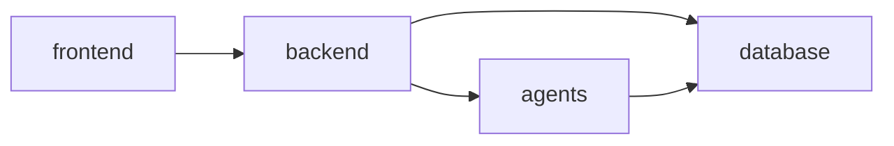

# 12_FOLDER_STRUCTURE.md — Final Repository Structure

| Field | Value |
|---|---|
| **Document** | 12_FOLDER_STRUCTURE.md |
| **Version** | 1.0.0 |
| **Author** | SentinelAI Enterprise Engineering Team (Enterprise Software Architect, DevOps Architect) |
| **Purpose** | Define the complete, final repository structure — every folder, every file, and the dependency rules governing them. |
| **Dependencies** | `docs/PROJECT_MEMORY.md` §4, `docs/ARCHITECTURE_RULES.md` §4, `docs/07_DATABASE_DESIGN.md`, `docs/08_API_SPECIFICATION.md`, `docs/09_FRONTEND_SPECIFICATION.md`, `docs/10_COMPONENT_LIBRARY.md`, `docs/11_AI_ARCHITECTURE.md` |
| **Status** | Draft — Hackathon Phase 2/3 |

### Revision History

| Version | Date | Author | Change |
|---|---|---|---|
| 1.0.0 | 2026-07-19 | Enterprise Engineering Team | Final, file-level repository structure |

This document supersedes the folder-level outline in `docs/PROJECT_MEMORY.md` §4 with a complete, file-level structure. Top-level folder names remain frozen and unchanged, per `docs/PROJECT_MEMORY.md` §12.

---

## 1. Complete Repository Tree

```
SentinelAI/
├── README.md
├── CONTRIBUTING.md
├── LICENSE
├── claude-prompts/
│   ├── 00_MASTER_CONTEXT.md
│   ├── 01_PROJECT_FOUNDATION.md
│   ├── 02_PRODUCT_AND_ARCHITECTURE_SUITE.md
│   └── 03_ENGINEERING_SPECIFICATIONS.md
├── docs/
│   ├── PROJECT_MEMORY.md
│   ├── CODING_STANDARDS.md
│   ├── ARCHITECTURE_RULES.md
│   ├── ROADMAP.md
│   ├── TASK_BOARD.md
│   ├── 01_PRD.md
│   ├── 02_SYSTEM_ARCHITECTURE.md
│   ├── 03_FUNCTIONAL_REQUIREMENTS.md
│   ├── 04_NON_FUNCTIONAL_REQUIREMENTS.md
│   ├── 05_USER_STORIES_AND_USE_CASES.md
│   ├── 06_SYSTEM_WORKFLOW.md
│   ├── 07_DATABASE_DESIGN.md
│   ├── 08_API_SPECIFICATION.md
│   ├── 09_FRONTEND_SPECIFICATION.md
│   ├── 10_COMPONENT_LIBRARY.md
│   ├── 11_AI_ARCHITECTURE.md
│   ├── 12_FOLDER_STRUCTURE.md
│   ├── 13_CONFIGURATION.md
│   └── 14_TRACEABILITY_MATRIX.md
├── frontend/
│   ├── index.html
│   ├── package.json
│   ├── vite.config.js
│   ├── tailwind.config.js
│   ├── .env.example
│   └── src/
│       ├── main.jsx
│       ├── App.jsx
│       ├── pages/
│       │   ├── DashboardPage.jsx
│       │   ├── CctvPage.jsx
│       │   ├── AlertsPage.jsx
│       │   ├── CompliancePage.jsx
│       │   ├── IncidentsPage.jsx
│       │   ├── AnalyticsPage.jsx
│       │   ├── AdminPage.jsx
│       │   └── LoginPage.jsx
│       ├── components/
│       │   ├── Button.jsx
│       │   ├── Card.jsx
│       │   ├── Table.jsx
│       │   ├── Chart.jsx
│       │   ├── Sidebar.jsx
│       │   ├── Navbar.jsx
│       │   ├── Modal.jsx
│       │   ├── Toast.jsx
│       │   ├── Notification.jsx
│       │   ├── CameraTile.jsx
│       │   ├── RiskMeter.jsx
│       │   ├── StatusBadge.jsx
│       │   ├── AlertCard.jsx
│       │   ├── Timeline.jsx
│       │   ├── ChatWindow.jsx
│       │   └── LoadingSkeleton.jsx
│       ├── services/
│       │   ├── apiClient.js
│       │   ├── authService.js
│       │   ├── dashboardService.js
│       │   ├── visionService.js
│       │   ├── alertsService.js
│       │   ├── analyticsService.js
│       │   ├── riskService.js
│       │   ├── complianceService.js
│       │   ├── emergencyService.js
│       │   ├── incidentsService.js
│       │   └── adminService.js
│       ├── hooks/
│       │   ├── useAuth.js
│       │   └── useRealtimeFeed.js
│       └── context/
│           └── AuthContext.jsx
├── backend/
│   ├── main.py
│   ├── requirements.txt
│   ├── .env.example
│   ├── api/
│   │   ├── auth.py
│   │   ├── dashboard.py
│   │   ├── vision.py
│   │   ├── cctv.py
│   │   ├── sensors.py
│   │   ├── risk.py
│   │   ├── compliance.py
│   │   ├── emergency.py
│   │   ├── incidents.py
│   │   ├── alerts.py
│   │   ├── analytics.py
│   │   ├── admin.py
│   │   └── health.py
│   ├── services/
│   │   ├── auth_service.py
│   │   ├── orchestration_service.py
│   │   ├── vision_service.py
│   │   ├── sensor_service.py
│   │   ├── risk_service.py
│   │   ├── compliance_service.py
│   │   ├── emergency_service.py
│   │   ├── incident_service.py
│   │   └── admin_service.py
│   ├── models/
│   │   ├── user.py
│   │   ├── site.py
│   │   ├── zone.py
│   │   ├── camera.py
│   │   ├── sensor.py
│   │   ├── detection.py
│   │   ├── sensor_reading.py
│   │   ├── risk_score.py
│   │   ├── alert.py
│   │   ├── emergency_protocol.py
│   │   ├── emergency_recommendation.py
│   │   ├── incident.py
│   │   ├── compliance_document.py
│   │   ├── compliance_embedding.py
│   │   └── audit_log.py
│   └── core/
│       ├── config.py
│       ├── security.py
│       ├── logging.py
│       └── database.py
├── agents/
│   ├── vision_agent.py
│   ├── sensor_agent.py
│   ├── risk_engine.py
│   ├── compliance_copilot.py
│   ├── emergency_agent.py
│   └── incident_generator.py
├── database/
│   ├── schema.sql
│   ├── migrations/
│   └── seed/
│       └── demo_seed.sql
├── datasets/
│   ├── vision_samples/
│   └── compliance_documents/
├── presentation/
│   └── pitch_deck.pptx
├── demo/
│   ├── demo_script.md
│   └── seed_data/
├── .github/
│   ├── ISSUE_TEMPLATE/
│   │   ├── bug_report.md
│   │   └── feature_request.md
│   └── PULL_REQUEST_TEMPLATE.md
└── tasks/
    └── .gitkeep
```

## 2. Folder Purpose Summary

| Folder | Purpose |
|---|---|
| `claude-prompts/` | Governing AI-authoring prompts (immutable inputs to the documentation process) |
| `docs/` | All product, architecture, and engineering documentation |
| `frontend/` | React + Vite SPA — presentation layer only |
| `backend/` | FastAPI application — API, orchestration, persistence |
| `agents/` | Six AI agent implementations — intelligence layer |
| `database/` | Schema, migrations, seed data |
| `datasets/` | Training/reference media and compliance source documents |
| `presentation/` | Pitch deck and demo-day assets |
| `demo/` | Demo script and seed data for live/recorded walkthroughs |
| `.github/` | Issue/PR templates, CI workflows |
| `tasks/` | Task tracking artifacts (supplements `docs/TASK_BOARD.md`) |

## 3. File-Level Descriptions

### 3.1 `frontend/`

| File/Folder | Purpose |
|---|---|
| `index.html` | Vite entry HTML |
| `package.json` | Dependencies (React, Vite, TailwindCSS, React Router, Axios, Recharts) |
| `vite.config.js` | Vite build/dev server configuration |
| `tailwind.config.js` | TailwindCSS theme configuration |
| `.env.example` | Documents required frontend env vars (e.g. `VITE_API_BASE_URL`) |
| `src/main.jsx` | React app entry point, mounts `App.jsx` |
| `src/App.jsx` | Root component — React Router route definitions |
| `src/pages/*.jsx` | The 8 pages defined in `docs/09_FRONTEND_SPECIFICATION.md` |
| `src/components/*.jsx` | The 16 reusable components defined in `docs/10_COMPONENT_LIBRARY.md` |
| `src/services/apiClient.js` | Shared Axios instance, interceptors, error normalization (`docs/CODING_STANDARDS.md` §7) |
| `src/services/*Service.js` | One Axios client module per API resource group (`docs/08_API_SPECIFICATION.md`) |
| `src/hooks/useAuth.js` | Authentication state hook (token storage, current user) |
| `src/hooks/useRealtimeFeed.js` | WebSocket/SSE subscription hook (`docs/06_SYSTEM_WORKFLOW.md` §5) |
| `src/context/AuthContext.jsx` | React Context provider for auth state |

### 3.2 `backend/`

| File/Folder | Purpose |
|---|---|
| `main.py` | FastAPI app instantiation, router registration, startup/shutdown hooks |
| `requirements.txt` | Python dependencies |
| `.env.example` | Documents required backend env vars (`docs/13_CONFIGURATION.md`) |
| `api/*.py` | Thin route handlers per resource group, one file per `docs/08_API_SPECIFICATION.md` module (`api/admin.py` covers `/api/v1/admin/*`; `api/health.py` covers `/api/v1/health`) |
| `services/*.py` | Business logic and agent orchestration; the only layer calling into `agents/` (`docs/ARCHITECTURE_RULES.md` §4) |
| `services/orchestration_service.py` | Coordinates multi-agent flows (e.g. detection → risk → alert → emergency → incident) |
| `models/*.py` | ORM models mirroring `docs/07_DATABASE_DESIGN.md` §5 tables 1:1, plus Pydantic request/response schemas |
| `core/config.py` | Centralized settings via `pydantic-settings`, sourced from environment variables |
| `core/security.py` | JWT issuance/verification, password hashing, RBAC dependency helpers |
| `core/logging.py` | Structured logging configuration (`docs/CODING_STANDARDS.md` §8) |
| `core/database.py` | Database engine/session setup, supporting both SQLite and PostgreSQL |

### 3.3 `agents/`

| File | Purpose |
|---|---|
| `vision_agent.py` | Vision Intelligence Agent (`docs/11_AI_ARCHITECTURE.md` §1) |
| `sensor_agent.py` | Sensor Intelligence Agent (`docs/11_AI_ARCHITECTURE.md` §2) |
| `risk_engine.py` | Compound Risk Engine (`docs/11_AI_ARCHITECTURE.md` §3) |
| `compliance_copilot.py` | Compliance Copilot (`docs/11_AI_ARCHITECTURE.md` §4) |
| `emergency_agent.py` | Emergency Response Agent (`docs/11_AI_ARCHITECTURE.md` §5) |
| `incident_generator.py` | Incident Report Generator (`docs/11_AI_ARCHITECTURE.md` §6) |

### 3.4 `database/`

| File/Folder | Purpose |
|---|---|
| `schema.sql` | Canonical DDL matching `docs/07_DATABASE_DESIGN.md` §5, portable across SQLite/PostgreSQL |
| `migrations/` | Alembic migration scripts (additive-first, per `docs/07_DATABASE_DESIGN.md` §8) |
| `seed/demo_seed.sql` | Demo-day seed data (sample site, zones, users, protocols) |

### 3.5 `datasets/`

| Folder | Purpose |
|---|---|
| `vision_samples/` | Sample/reference footage and labeled frames for the Vision Intelligence Agent |
| `compliance_documents/` | Source regulatory/SOP documents for Compliance Copilot ingestion |

### 3.6 `.github/`

| File/Folder | Purpose |
|---|---|
| `ISSUE_TEMPLATE/bug_report.md` | Bug report template (`docs/CONTRIBUTING.md`) |
| `ISSUE_TEMPLATE/feature_request.md` | Feature request template |
| `PULL_REQUEST_TEMPLATE.md` | PR checklist template |

## 4. Dependency Rules (Reference)

Reproduced from `docs/ARCHITECTURE_RULES.md` §4 for convenience — this document does not redefine these rules, only reflects them in the file tree above:



- `frontend/src/services/*` is the **only** place Axios is imported (`docs/CODING_STANDARDS.md` §2).
- `backend/api/*` never imports from `agents/` directly — always via `backend/services/*`.
- `agents/*.py` never import from `backend/` or from each other; they only depend on `database/` access helpers and shared utilities.
- `database/` has no dependency on any other top-level folder.

## 5. File Naming Compliance

Every filename above follows `docs/CODING_STANDARDS.md` §5: Python modules `snake_case.py`, React components `PascalCase.jsx`, React services/hooks `camelCase.js`.

---

## Glossary

| Term | Definition |
|---|---|
| Thin route handler | An `api/` function that only validates input and delegates to `services/`, containing no business logic itself |

## References

- `docs/PROJECT_MEMORY.md`, `docs/ARCHITECTURE_RULES.md`, `docs/07_DATABASE_DESIGN.md`, `docs/08_API_SPECIFICATION.md`, `docs/09_FRONTEND_SPECIFICATION.md`, `docs/10_COMPONENT_LIBRARY.md`, `docs/11_AI_ARCHITECTURE.md`

## Assumptions

- Exact test file locations (`tests/` per module vs. co-located `test_*.py`) are deferred to implementation start; `docs/CODING_STANDARDS.md` §5 defines the naming convention but this tree does not yet enumerate test files, to avoid speculative structure ahead of Phase 2 implementation.

## Future Improvements

- Add a `docker/` folder with `Dockerfile.frontend`/`Dockerfile.backend` once Phase 4 deployment work begins (`docs/ROADMAP.md` Phase 4).
- Add `.github/workflows/` CI pipeline definitions once test suites exist.
