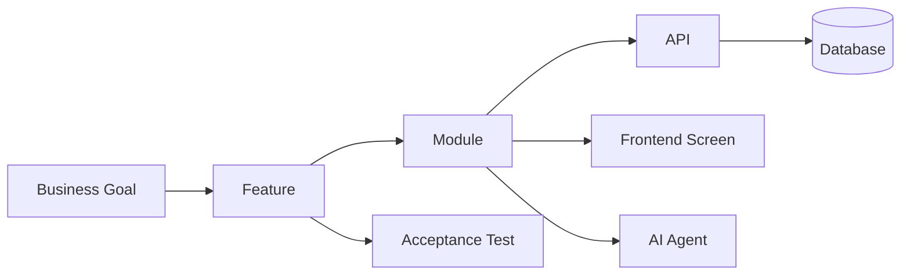

# 14_TRACEABILITY_MATRIX.md — Implementation Traceability Matrix

| Field | Value |
|---|---|
| **Document** | 14_TRACEABILITY_MATRIX.md |
| **Version** | 1.0.0 |
| **Author** | SentinelAI Enterprise Engineering Team (all seven architecture roles per `claude-prompts/03_ENGINEERING_SPECIFICATIONS.md`) |
| **Purpose** | Prove every business requirement is traceable end-to-end from business goal through to acceptance test. |
| **Dependencies** | `docs/01_PRD.md` through `docs/13_CONFIGURATION.md` (entire documentation suite) |
| **Status** | Draft — Hackathon Phase 2/3, Final Step of the Engineering Specification Suite |

### Revision History

| Version | Date | Author | Change |
|---|---|---|---|
| 1.0.0 | 2026-07-19 | Enterprise Engineering Team | Initial traceability matrix, 14 rows |

---

## 1. Traceability Chain

## 2. Matrix

| # | Business Goal (`01_PRD.md` §4) | Feature | Module | API | Database Table(s) | Frontend Screen | AI Agent | Acceptance Test |
|---|---|---|---|---|---|---|---|---|
| 1 | Reduce time-to-detection | PPE / intrusion / fire / unsafe-operation detection | Vision | `POST/GET /api/v1/vision/detections`, `GET /api/v1/cctv/streams` | `detections`, `cameras`, `zones` | Camera Monitoring (`CctvPage.jsx`) | Vision Intelligence Agent | FR-VIS-001–006 |
| 2 | Reduce time-to-detection | Sensor anomaly detection | Sensors | `GET/POST /api/v1/sensors/readings`, `GET /api/v1/sensors/readings/{id}` (`docs/08_API_SPECIFICATION.md` §5) | `sensor_readings`, `sensors`, `zones` | Dashboard (`DashboardPage.jsx`, zone detail) | Sensor Intelligence Agent | FR (Sensor module, `docs/11_AI_ARCHITECTURE.md` §2) |
| 3 | Reduce time-to-detection | Compound risk scoring with rationale | Risk Engine | `GET /api/v1/risk/scores`, `GET /api/v1/risk/scores/{id}`, `GET /api/v1/risk/scores/latest` | `risk_scores`, `detections`, `sensor_readings` | Dashboard (`DashboardPage.jsx`) | Compound Risk Engine | FR-RISK-001–005 |
| 4 | Reduce time-to-response | Real-time severity-ranked alerting | Alerts | `GET /api/v1/alerts`, `PATCH /api/v1/alerts/{id}/acknowledge` | `alerts`, `risk_scores` | Alert Center (`AlertsPage.jsx`), Dashboard | Compound Risk Engine (trigger source) | FR-ALT-001–005 |
| 5 | Reduce time-to-response | Emergency protocol recommendation | Emergency Response | `GET /api/v1/emergency/recommendations`, `GET/POST /api/v1/emergency/protocols` | `emergency_recommendations`, `emergency_protocols`, `alerts` | Dashboard / Alert Center (recommendation panel) | Emergency Response Agent | FR-EMR-001–004 |
| 6 | Reduce incident investigation time | Auto-drafted, evidence-linked incident reports | Reports | `GET /api/v1/incidents`, `GET /api/v1/incidents/{id}`, `PATCH /api/v1/incidents/{id}/approve`, `GET /api/v1/incidents/{id}/export` | `incidents`, `risk_scores`, `emergency_recommendations` | Incident Reports (`IncidentsPage.jsx`) | Incident Report Generator | FR-REP-001–004 |
| 7 | Improve compliance posture | Cited, grounded compliance Q&A | Compliance | `POST /api/v1/compliance/query` | `compliance_documents`, `compliance_embeddings`, `audit_logs` | Compliance Copilot (`CompliancePage.jsx`) | Compliance Copilot | FR-COMP-001/002 |
| 8 | Improve compliance posture | Compliance document ingestion | Compliance | `POST /api/v1/compliance/documents`, `GET /api/v1/compliance/documents` | `compliance_documents`, `compliance_embeddings` | Compliance Copilot (document panel) | Compliance Copilot | FR-COMP-003 |
| 9 | Defensible AI safety record | Compliance query audit trail | Compliance | `GET /api/v1/compliance/queries` | `audit_logs` | Compliance Copilot (query history, `compliance_officer`/`admin`) | Compliance Copilot | FR-COMP-004 |
| 10 | Demonstrate a credible working platform | Unified live risk/alert/agent-health dashboard | Dashboard | `GET /api/v1/dashboard/overview`, `GET /api/v1/dashboard/status` | `risk_scores`, `alerts` (aggregated) | Dashboard (`DashboardPage.jsx`) | All six (status aggregation) | FR-DASH-001–005 |
| 11 | Demonstrate a credible working platform | Historical trend and posture analytics | Analytics | `GET /api/v1/analytics/risk-trends`, `GET /api/v1/analytics/incident-frequency`, `GET /api/v1/analytics/compliance-summary` | `risk_scores`, `incidents`, `compliance_documents` | Analytics (`AnalyticsPage.jsx`) | N/A (aggregation of persisted agent outputs) | FR-ANL-001–005 |
| 12 | Enable secure, role-appropriate access | Authentication and session management | Authentication | `POST /api/v1/auth/login`, `POST /api/v1/auth/refresh`, `POST /api/v1/auth/logout` | `users` | Login (`LoginPage.jsx`) | N/A | FR-AUTH-001–005 |
| 13 | Enable secure, role-appropriate access | Platform administration (users, sites, devices, thresholds) | Administration | `GET/POST/PATCH /api/v1/admin/*` | `users`, `sites`, `zones`, `cameras`, `sensors`, `audit_logs` | Settings (`AdminPage.jsx`) | N/A | FR-ADM-001–005 |
| 14 | Demonstrate a credible working platform | System health/uptime visibility | Dashboard (system) | `GET /api/v1/health` | N/A (live connectivity check, no table) | Dashboard (`DashboardPage.jsx`, status strip) | N/A | NFR-MON-001 |

## 3. Coverage Check

Every row above traces to at least one Functional or Non-Functional Requirement ID, confirming full coverage of `docs/03_FUNCTIONAL_REQUIREMENTS.md` module groups (Dashboard, Vision, Alerts, Analytics, Risk Engine, Compliance, Emergency Response, Reports, Authentication, Administration) and every one of the six AI agents (`docs/11_AI_ARCHITECTURE.md`).

| Module (per `03_FUNCTIONAL_REQUIREMENTS.md`) | Row(s) |
|---|---|
| Dashboard | 3, 10, 14 |
| Vision | 1 |
| Alerts | 4 |
| Analytics | 11 |
| Risk Engine | 3 |
| Compliance | 7, 8, 9 |
| Emergency Response | 5 |
| Reports | 6 |
| Authentication | 12 |
| Administration | 13 |

| AI Agent | Row(s) |
|---|---|
| Vision Intelligence Agent | 1 |
| Sensor Intelligence Agent | 2 |
| Compound Risk Engine | 3, 4 (trigger source) |
| Compliance Copilot | 7, 8, 9 |
| Emergency Response Agent | 5 |
| Incident Report Generator | 6 |

No module, agent, or business goal from `docs/01_PRD.md` §4–§5 is left untraced.

---

## Glossary

| Term | Definition |
|---|---|
| Traceability | The ability to follow a requirement from its business origin through to a verifiable test |
| Coverage | Confirmation that every defined module/agent/goal appears in at least one matrix row |

## References

- `docs/01_PRD.md` through `docs/13_CONFIGURATION.md` (full documentation suite)

## Assumptions

- Row 14 (`/api/v1/health`) has no associated database table by design — it is a live connectivity probe, not a persisted entity.

## Future Improvements

- Extend this matrix with acceptance test IDs (e.g. `AT-001`) once a formal test plan/suite exists, rather than referencing FR/NFR IDs directly.
