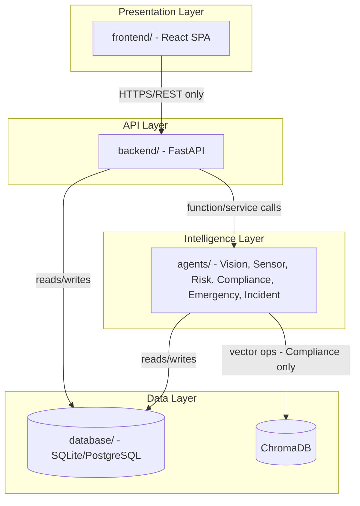
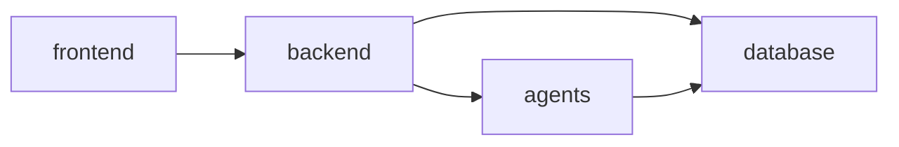

# ARCHITECTURE_RULES.md

This document defines the binding architectural rules for SentinelAI. It is derived from and must remain consistent with `claude-prompts/00_MASTER_CONTEXT.md`, `PROJECT_MEMORY.md`, and `CODING_STANDARDS.md`.

---

## 1. System Boundaries

SentinelAI consists of four layers, each with a hard boundary:

- The **Presentation Layer** never accesses the Intelligence or Data layers directly.
- The **API Layer** is the only entry point into the system from outside the backend process boundary.
- The **Intelligence Layer** never serves HTTP directly; agents are invoked as internal services by the backend.
- The **Data Layer** is only accessed through the backend/agents — never directly by the frontend.

---

## 2. Module Responsibilities

| Module | Responsibility | Must NOT do |
|---|---|---|
| Vision Intelligence Agent | Detect hazards/PPE/intrusion from CCTV frames (YOLOv8 + OpenCV) | Compute compound risk; write incident reports |
| Sensor Intelligence Agent | Interpret sensor telemetry, flag anomalies | Access video frames; compute compound risk |
| Compound Risk Engine | Fuse Vision + Sensor outputs into one explainable risk score | Perform detection or emergency dispatch itself |
| Compliance Copilot | Answer regulatory/SOP questions via RAG over ChromaDB | Access live camera/sensor data |
| Emergency Response Agent | Recommend/trigger emergency protocol when risk crosses threshold | Compute risk itself; edit compliance documents |
| Incident Report Generator | Draft structured incident reports from stored evidence | Modify detections/sensor readings after the fact |
| Backend (FastAPI) | Auth, orchestration, persistence, API contracts | Contain AI model inference logic |
| Frontend (React) | Presentation, user interaction, visualization | Contain business logic or direct DB/agent access |

---

## 3. Separation of Concerns

- Each agent in `agents/` is a standalone Python module with a single public interface function (e.g. `run(input) -> output`). No agent imports another agent's internals — cross-agent communication happens only through the backend orchestration layer (`backend/services/`).
- Frontend components are presentation-only; all business logic (risk thresholds, formatting rules tied to domain meaning) lives in the backend, not in React components.
- Database access is confined to `backend/models/` and each agent's own persistence calls — no ad hoc SQL scattered across the codebase.

---

## 4. Dependency Rules

- `frontend/` may depend only on its own `src/` tree and published npm packages. It must never import from `backend/` or `agents/`.
- `backend/` may depend on `agents/` and `database/`. It must never import from `frontend/`.
- `agents/` may depend on `database/` and shared utility modules. Agents must never depend on `backend/` (to keep them independently testable/deployable) and must never depend on each other directly.
- `database/` has no dependencies on any other top-level folder.

---

## 5. Communication Rules

- Frontend ↔ Backend: REST over HTTPS, JSON payloads, versioned under `/api/v1`, using the standard response envelope defined in `CODING_STANDARDS.md`.
- Backend ↔ Agents: direct async function/service calls within the same process (or internal RPC if an agent is later split into its own service — must be documented here first if that changes).
- Agent ↔ Agent: never direct. All cross-agent data flows through the backend orchestration layer or the database (e.g. Compound Risk Engine reads persisted Vision/Sensor outputs; it does not call those agents itself).
- Real-time updates (alerts, live risk state) are delivered to the frontend via WebSocket or Server-Sent Events from the backend — never by agents pushing directly to clients.

---

## 6. API Rules

- All endpoints versioned under `/api/v1`; breaking changes require a new version, never a rename (see `PROJECT_MEMORY.md` Section 12).
- Every endpoint must be documented with: Endpoint, Purpose, Request, Response, Error Codes, Authentication, Validation, Example JSON.
- All endpoints (except `/api/v1/auth/login`) require authentication.
- All request/response bodies validated via Pydantic models — no unvalidated input reaches agent or database layers.

---

## 7. Database Rules

- SQLite (MVP) and PostgreSQL (production) must share one schema definition; no SQLite-only or PostgreSQL-only column types.
- Every table has a surrogate primary key (`id`, UUID) and `created_at`/`updated_at` timestamps.
- Foreign keys are always explicit and indexed.
- No destructive migrations without a documented rollback path.
- Full ER diagram and constraints are tracked in a future `docs/DATABASE_SCHEMA.md` (see `ROADMAP.md` Phase 2).

---

## 8. AI Agent Interaction Rules

- Every agent output must include an explanation/rationale field — no black-box outputs (Explainability principle).
- The Compound Risk Engine is the **only** module permitted to merge Vision and Sensor signals.
- The Emergency Response Agent may only act on risk scores produced by the Compound Risk Engine — never on raw Vision or Sensor output directly.
- The Incident Report Generator may only read persisted, immutable evidence records — it must never mutate source detection/sensor data.
- The Compliance Copilot's retrieval scope is limited to documents explicitly ingested into `compliance_documents`/ChromaDB; it must never fabricate citations.

---

## 9. Scalability Principles

- Stateless backend processes — all state lives in the database or vector store, enabling horizontal scaling.
- Vision Intelligence Agent inference is designed to be offloadable to a separate worker/edge process without changing its public interface.
- Database access uses connection pooling from day one, even on SQLite-compatible code paths, to ease the SQLite → PostgreSQL transition.

## 10. Maintainability Principles

- No module exceeds a single clear responsibility (Section 2).
- All public functions/classes are documented (Google-style docstrings per `CODING_STANDARDS.md`).
- Configuration is centralized (`backend/core/config.py`); no scattered environment reads.

## 11. Explainability Principles

- Every AI-driven decision (detection, risk score, emergency recommendation) is persisted with its contributing inputs and a human-readable rationale.
- The AI Dashboard must always be able to answer "why" for any risk score or alert shown to a user.

---

## 12. Things Developers Must Never Do

- Never let the frontend call an AI agent or the database directly.
- Never let two agents call each other directly.
- Never rename an existing API endpoint, database table/column, module, or folder (version/migrate instead).
- Never hardcode secrets, API keys, or thresholds — use `backend/core/config.py`.
- Never merge code that lacks tests for new backend/agent logic.
- Never bypass the standard API response envelope or error format.
- Never let the Compound Risk Engine, Emergency Response Agent, or Incident Report Generator run without producing an explainable rationale.
