# ROADMAP.md

SentinelAI phased roadmap, scoped to the 3-day hackathon timeline defined in `claude-prompts/00_MASTER_CONTEXT.md`. Each phase lists milestones, deliverables, estimated completion, dependencies, risks, and success criteria.

---

## Phase 1 — Foundation & Documentation

**Timeframe**: Day 1, morning (0–4 hrs)

**Milestones**
- Governing context and foundation directives established
- Full documentation set generated and internally audited for consistency

**Deliverables**
- `README.md`, `docs/PROJECT_MEMORY.md`, `docs/CODING_STANDARDS.md`, `docs/ARCHITECTURE_RULES.md`, `docs/ROADMAP.md`, `docs/TASK_BOARD.md`, `CONTRIBUTING.md`, `LICENSE`
- Repository folder scaffold matching `PROJECT_MEMORY.md` Section 4
- Product & Architecture Suite: `docs/01_PRD.md`, `docs/02_SYSTEM_ARCHITECTURE.md`, `docs/03_FUNCTIONAL_REQUIREMENTS.md`, `docs/04_NON_FUNCTIONAL_REQUIREMENTS.md`, `docs/05_USER_STORIES_AND_USE_CASES.md`, `docs/06_SYSTEM_WORKFLOW.md`

**Dependencies**: None (starting point)

**Risks**
- Documentation scope creep eating into build time → mitigated by fixed file list and time box
- Naming inconsistency propagating into code → mitigated by the mandatory consistency audit (Section "Final Step" of `claude-prompts/01_PROJECT_FOUNDATION.md`)

**Success Criteria**
- All 8 foundation documents exist, are internally consistent, and reference no undefined modules/APIs/tables

---

## Phase 2 — Core Backend, Database & Agent Scaffolding

**Timeframe**: Day 1, afternoon → Day 2, morning (4–16 hrs)

**Milestones**
- FastAPI backend skeleton with `/api/v1` routing live
- SQLite schema implemented from `database/` design, ORM models in `backend/models/`
- Six agent modules scaffolded in `agents/` with defined input/output contracts (even if using stub/mock inference initially)
- Vision Intelligence Agent producing real YOLOv8 detections on sample footage
- Sensor Intelligence Agent parsing sample telemetry

**Deliverables**
- Engineering Specification Suite (documentation, completed ahead of schedule during the doc-generation pass): `docs/07_DATABASE_DESIGN.md`, `docs/08_API_SPECIFICATION.md`, `docs/11_AI_ARCHITECTURE.md`, `docs/12_FOLDER_STRUCTURE.md`, `docs/13_CONFIGURATION.md`
- Working backend service with health check and at least 3 live endpoints, implemented per `docs/08_API_SPECIFICATION.md`
- `agents/vision_agent.py`, `agents/sensor_agent.py` functional against sample data, implemented per `docs/11_AI_ARCHITECTURE.md` §1/§2

**Dependencies**: Phase 1 complete (folder structure, naming conventions locked)

**Risks**
- YOLOv8 model setup/training data availability → mitigate by using a pretrained model + fine-tuning only if time allows
- Schema churn once real data shapes are known → mitigate by keeping schema additive (no destructive changes) per `ARCHITECTURE_RULES.md`

**Success Criteria**
- Backend boots, connects to SQLite, and returns real detection/sensor data through versioned REST endpoints

---

## Phase 3 — Frontend, Integration & End-to-End Agent Wiring

**Timeframe**: Day 2, afternoon → Day 3, morning (16–28 hrs)

**Milestones**
- React + Vite dashboard scaffolded and connected to backend via Axios services
- AI Dashboard, CCTV Monitoring, Alerts, and Analytics pages functional against live API data
- Compound Risk Engine fusing Vision + Sensor signals end-to-end
- Compliance Copilot answering questions via ChromaDB RAG over at least one ingested regulation/SOP document
- Emergency Response Agent and Incident Report Generator triggered by real risk-threshold events

**Deliverables**
- Frontend implemented per `docs/09_FRONTEND_SPECIFICATION.md` (wireframes, components, API mapping, user flow) and `docs/10_COMPONENT_LIBRARY.md`
- Agents implemented per `docs/11_AI_ARCHITECTURE.md` (input/output/model/flow/prompt templates/limitations per agent)
- Fully wired demo path: camera/sensor input → risk score → dashboard alert → incident report

**Dependencies**: Phase 2 backend/agent contracts stable

**Risks**
- Integration latency between agents and frontend real-time updates → mitigate with WebSocket/SSE fallback to polling
- RAG answer quality on limited ingested documents → mitigate by curating a small, high-quality compliance document set

**Success Criteria**
- A single end-to-end scenario (hazard detected → risk scored → alert shown → incident drafted) runs live in the dashboard without manual intervention

---

## Phase 4 — Polish, Demo Prep & Deployment

**Timeframe**: Day 3, afternoon (28–36 hrs)

**Milestones**
- UI/UX polish pass across all dashboard pages
- Demo script and sample data finalized in `demo/`
- Pitch deck finalized in `presentation/`
- Optional Docker packaging and deployment to Render/Railway/Vercel

**Deliverables**
- Polished, presentable AI Dashboard
- `demo/` walkthrough assets and seed data
- `presentation/` pitch deck
- Deployed (or deployment-ready) build

**Dependencies**: Phase 3 end-to-end path working

**Risks**
- Time pressure causing scope cuts → mitigate by prioritizing the single end-to-end demo path over feature breadth
- Deployment environment issues late in the timeline → mitigate by keeping Docker/deployment optional and testing early if attempted

**Success Criteria**
- A 3–5 minute live or recorded demo shows the full SentinelAI flow convincingly, backed by working software (not mockups)

---

## Roadmap Summary

```mermaid
gantt
    dateFormat  X
    axisFormat %s
    title SentinelAI 3-Day Hackathon Roadmap (hours elapsed)
    section Phase 1
    Foundation & Documentation :done, p1, 0, 4
    section Phase 2
    Backend, DB, Agent Scaffolding :p2, 4, 16
    section Phase 3
    Frontend & Agent Integration :p3, 16, 28
    section Phase 4
    Polish, Demo, Deployment :p4, 28, 36
```

